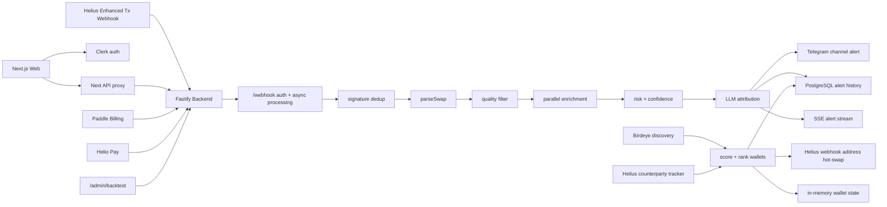

# Smart Money Radar

Smart Money Radar 是一个 Solana 聪明钱监控平台。系统接收 Helius Enhanced Transaction webhook，解析并过滤钱包买入行为，并行富集代币数据，计算风险与信号置信度，推送 Telegram 告警，同时提供付费 Web Dashboard 查看告警历史、监控钱包、Telegram 绑定和管理员回测。

当前状态：Phase 3d 已完成，Phase 4 待启动。本文档最后更新于 2026-05-30。

## 核心能力

- 监控人工置顶钱包和自动发现的 Solana 聪明钱钱包。
- 解析 Helius swap 交易，按 signature 去重，并过滤低质量代币。
- 并行富集 DexScreener、Solana 权限检查、Raydium V3 链上价格交叉校验和可选 Birdeye metadata。
- 通过 OpenAI-compatible LLM 接口生成中文短归因。
- 向 Telegram 私有频道发送带风险标签、置信度、数据源说明和免责声明的告警。
- 在配置数据库时持久化告警历史和钱包状态。
- 提供 Clerk 保护的 Next.js Dashboard 和订阅拦截。
- 支持 Paddle Billing 与 Helio Pay webhook 激活订阅。
- 提供回测管线和管理员页面，用于验证钱包发现质量。

## 架构概览



完整架构、数据流、路由地图、实现原则和已知缺口见 [docs/current-architecture.md](/Users/longkai/workspace/smart-money-radar/docs/current-architecture.md)。

## 仓库结构

```text
apps/
  backend/        Fastify 服务、webhook pipeline、富集、发现、支付、Telegram、回测 API
  web/            Next.js 16 Dashboard、Landing、鉴权、Pricing、Admin UI
packages/
  db/             Drizzle schema、Neon HTTP client、PostgreSQL pool client
  shared/         共享领域类型和常量
docs/
  current-architecture.md
  roadmap.md
  plans/
  solutions/
```

## 技术栈

| 领域 | 技术 |
| --- | --- |
| 后端 | TypeScript、Node.js、Fastify 5、Zod、Pino、Sentry |
| Solana | Helius Enhanced Transactions、Helius webhook management、`@solana/kit` |
| 富集 | DexScreener、Birdeye、Raydium V3 cross-validation、Token authority checks |
| AI | 通过 `LLM_*` 配置接入 OpenAI-compatible chat completions |
| 推送 | Telegram Bot API、Telegram webhook |
| Web | Next.js 16 App Router、React 19、Tailwind CSS 4、next-intl、Clerk |
| 支付 | Paddle Billing、Helio Pay |
| 数据 | PostgreSQL/Neon、Drizzle ORM |
| 测试 | Vitest、TypeScript strict mode |

## 快速开始

```bash
pnpm install
cp .env.example .env
cp apps/web/.env.example apps/web/.env.local
```

优先填入这些变量：

- 后端核心：`HELIUS_AUTH_TOKEN`、`TELEGRAM_BOT_TOKEN`、`TELEGRAM_CHANNEL_ID`、`SOLANA_RPC_URL`、`LLM_API_KEY`
- Web 核心：`NEXT_PUBLIC_CLERK_PUBLISHABLE_KEY`、`CLERK_SECRET_KEY`、`BACKEND_API_URL`、`BACKEND_API_KEY`
- 数据库功能：后端 `DATABASE_POOL_URL`，Web `DATABASE_URL`

启动后端：

```bash
pnpm --filter backend dev
```

另开终端启动 Web：

```bash
pnpm --filter web dev -- --port 3001
```

默认本地地址：

- 后端：`http://localhost:3000`
- Web：`http://localhost:3001`

## 核心后端路由

| 路由 | 用途 | 鉴权 |
| --- | --- | --- |
| `POST /webhook` | Helius Enhanced Transaction webhook | `HELIUS_AUTH_TOKEN` |
| `GET /health` | 服务和可选 DB 健康检查 | 无 |
| `GET /api/v1/alerts` | 游标分页告警历史 | 配置 `BACKEND_API_KEY` 时需要 `X-API-Key` |
| `GET /api/v1/wallets` | 活跃监控钱包 | 配置 `BACKEND_API_KEY` 时需要 `X-API-Key` |
| `GET /api/v1/wallets/:address` | 钱包详情和最近告警 | 配置 `BACKEND_API_KEY` 时需要 `X-API-Key` |
| `GET /api/v1/alerts/stream` | 实时告警 SSE | 当前无后端鉴权 |
| `POST /api/v1/checkout` | 创建 Paddle checkout transaction | 仅 Paddle 环境变量完整时启用 |
| `POST /webhooks/paddle` | Paddle 订阅 webhook | Paddle signature |
| `POST /webhooks/helio` | Helio Pay webhook | bearer token 加可选 HMAC |
| `POST /webhooks/telegram` | Telegram bot webhook | Telegram secret token |
| `GET /api/v1/telegram/bind-code` | 生成 Telegram 绑定码 | 需要 DB |
| `GET /api/v1/telegram/status` | 查询 Telegram 绑定状态 | 需要 DB |
| `POST /api/v1/admin/backtest` | 启动管理员回测 | `X-Admin-Key` |
| `GET /api/v1/admin/backtest/status` | 当前回测状态 | `X-Admin-Key` |
| `GET /api/v1/admin/backtest/report` | 最新回测报告 | `X-Admin-Key` |
| `GET /api/v1/admin/backtest/stream` | 回测进度 SSE | `X-Admin-Key` |

## 常用命令

```bash
# 全仓库测试
pnpm test

# 后端
pnpm --filter backend test
pnpm --filter backend typecheck
pnpm --filter backend backtest -- --help

# Web
pnpm --filter web lint
pnpm --filter web build

# 数据库
pnpm --filter @radar/db db:generate
pnpm --filter @radar/db db:migrate
pnpm --filter @radar/db db:studio
```

## 文档入口

- [当前架构](/Users/longkai/workspace/smart-money-radar/docs/current-architecture.md)：系统架构、数据流、路由地图、实现原则、已知缺口。
- [路线图](/Users/longkai/workspace/smart-money-radar/docs/roadmap.md)：已完成阶段、当前风险和下一阶段建议。
- [生产环境清单](/Users/longkai/workspace/smart-money-radar/docs/plans/production-env-checklist.md)：Railway、Vercel、Neon、Clerk、Paddle、Helio、Telegram、Helius、Birdeye 配置。
- [组合工作流](/Users/longkai/workspace/smart-money-radar/docs/templates/combined-workflow.md)：新功能要求遵守的 6 步流程。
- [知识库](/Users/longkai/workspace/smart-money-radar/docs/solutions)：长期沉淀的实现经验和踩坑记录。

## 当前已知缺口

- `alerts_history` 当前持久化核心告警字段；实时 SSE 会带置信度字段，Web 告警卡片也能渲染，但 Drizzle schema 尚未完整持久化历史置信度列。
- `subscriptions` 表仍保留历史 `stripe*` 字段名，但当前支付集成是 Paddle 和 Helio。
- 仓库内 `apps/backend/config/smart-money-addresses.json` 为空，生产环境需要配置 pinned wallets，或依赖 discovery。
- `/api/v1/alerts/stream` 当前后端无鉴权，公开部署时应在代理层或网络层保护。

## License

MIT
