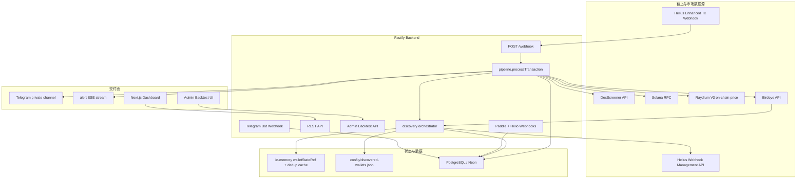
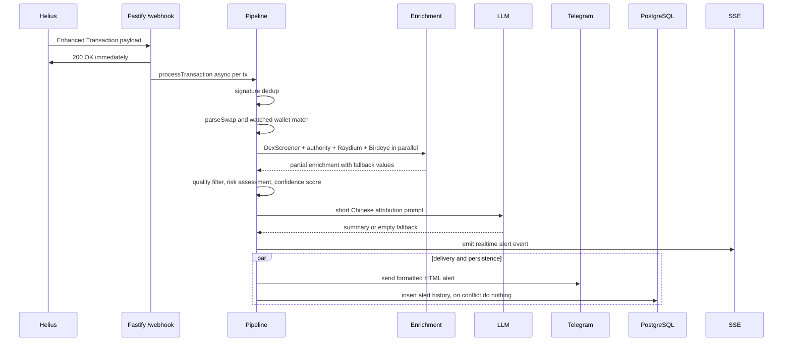
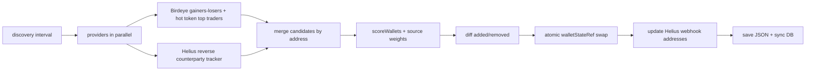
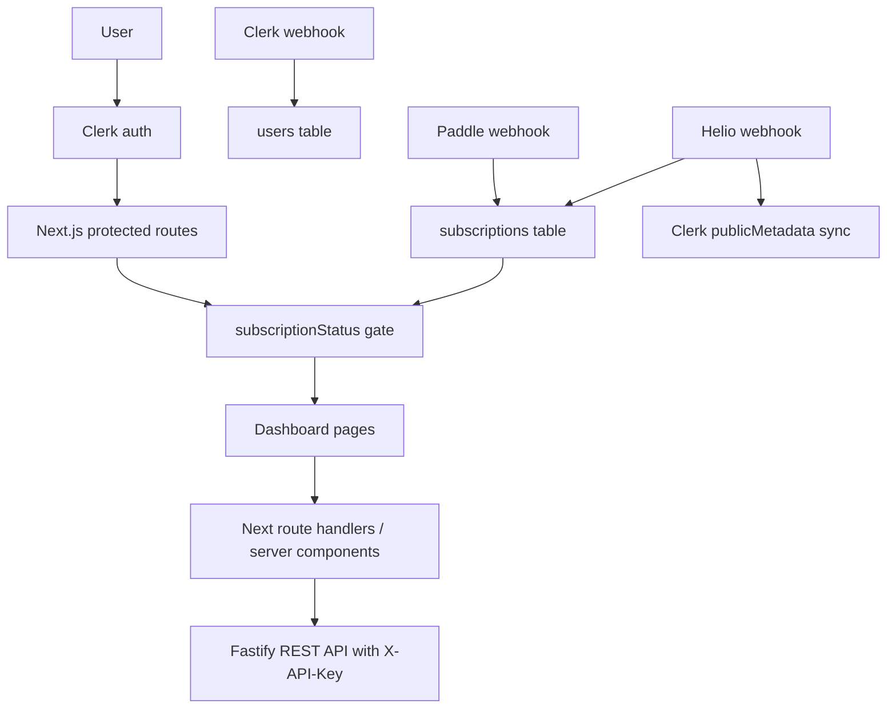
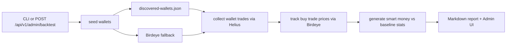

# Smart Money Radar 当前架构总览

更新时间：2026-05-30

本文记录当前代码库的真实实现状态，覆盖架构、配置、数据流、路由、实现原理和已知缺口。历史计划和方案文档仍保留在 `docs/plans/` 与 `docs/solutions/`，但以本文和根目录 `README.md` 作为当前状态入口。

## 1. 系统定位

Smart Money Radar 当前已经不是单纯 Telegram bot，而是一个 Solana 聪明钱信号平台：

- 后端监听 Helius Enhanced Transaction Webhooks。
- 后端对交易进行解析、去重、质量过滤、数据富集、风险评估、置信度评分、AI 归因。
- 告警同步推送到 Telegram、PostgreSQL 和 SSE 实时流。
- 自动发现模块定期扩充被监控钱包，并热更新 Helius webhook 地址。
- Web 端提供 Landing、Pricing、Dashboard、Telegram 绑定和 Admin 回测控制台。
- 订阅状态由 Paddle Billing 或 Helio Pay webhook 写入数据库，并可同步到 Clerk publicMetadata。

## 2. 运行时组件

| 组件 | 路径 | 职责 |
| --- | --- | --- |
| Fastify 后端 | `apps/backend/src/index.ts` | 服务入口、环境变量校验、路由注册、pipeline 组装 |
| Webhook 管线 | `apps/backend/src/webhook/`, `apps/backend/src/pipeline.ts` | 接收 Helius webhook、交易去重、解析、处理告警 |
| 富集模块 | `apps/backend/src/enrichment/` | DexScreener、Birdeye metadata、Solana authority、Raydium 价格交叉校验、置信度评分 |
| 发现模块 | `apps/backend/src/discovery/` | Birdeye + Helius reverse discovery，多源合并、评分、热更新 webhook |
| AI 归因 | `apps/backend/src/ai/attribution.ts` | OpenAI-compatible chat completions 调用、10 分钟 LRU 缓存 |
| Telegram | `apps/backend/src/telegram/` | 告警格式化、发送、双向 webhook、绑定码、加入请求、过期成员清理 |
| Billing | `apps/backend/src/stripe/`, `apps/backend/src/helio/` | Paddle checkout/webhook 与 Helio Pay webhook |
| Backtest | `apps/backend/src/scripts/backtest/` | 采集交易、追踪价格、分析报告、管理 API 复用 runner |
| Web App | `apps/web/src/app/` | Next.js 页面、API proxy、Clerk webhook、Dashboard、Admin |
| DB package | `packages/db/` | Drizzle schema、Neon HTTP client、Postgres pool client |
| Shared package | `packages/shared/` | 共享领域类型和常量 |

## 3. 总体架构图

## 4. 告警数据流

关键实现点：

- `POST /webhook` 先返回 `200 OK`，逐笔交易异步处理，避免 Helius 重试导致告警风暴。
- `TxDedup` 使用进程内 LRU 按 signature 去重。
- `parseSwap` 只处理 `SWAP` 类型事件，并排除 SOL、USDC、USDT 等基础支付腿。
- `enrichToken` 使用 `Promise.allSettled` 与每路 2 秒超时，任何外部服务失败都不会阻塞告警。
- `passesQualityFilter` 过滤低流动性、低 FDV、低成交量、刚创建池子的高噪音信号。
- `computeConfidence` 以链上权限、DexScreener 数据完整度、流动性、钱包来源为加分项，以 stale 数据和价格偏差为降分项。
- Telegram 发送与 DB 写入并行执行；DB 写入失败只记录日志，不阻塞 Telegram。

## 5. 自动发现数据流

实现原则：

- pinned wallets 永远保留，discovered wallets 受 `DISCOVERY_WALLET_CAP` 控制。
- discovery 启动时优先加载 `discovered-wallets.json`，容器重启且本地文件丢失时可从数据库恢复活跃钱包。
- Birdeye provider 拉取 top wallets、hot tokens、token top traders；Helius reverse provider 从已观察到的交易对手中挖候选钱包。
- 多源候选会聚合 `sources`，同地址优先保留指标更完整或 PnL 更高的记录。
- Helius webhook 更新失败时不持久化本轮结果，避免数据库状态与真实 webhook 地址漂移。

## 6. Web 与订阅数据流

当前授权模型：

- `apps/web/src/proxy.ts` 使用 Clerk 保护所有非公开路由。
- `/dashboard/*` 需要用户登录，并由 `dashboard/layout.tsx` 检查 `publicMetadata.subscriptionStatus === "active"`。
- `/admin/*` 需要用户登录，并由 `admin/layout.tsx` 检查 `publicMetadata.role === "admin"`。
- Web 端通过 `BACKEND_API_URL` + `BACKEND_API_KEY` 调用后端 REST API。

订阅实现说明：

- Paddle checkout 由后端 `POST /api/v1/checkout` 创建交易。
- Paddle webhook 写入 `subscriptions` 表，并把 Paddle subscription id 存入历史命名字段 `stripeSubscriptionId`。
- Helio webhook 通过用户 email 匹配 DB 用户，写入 `subscriptions` 表，并可异步同步 Clerk `subscriptionStatus`。
- 代码中仍有 `stripe*` 字段名，这是 Phase 2 支付方案迁移后的遗留命名，不代表当前仍依赖 Stripe。

## 7. 回测数据流

回测有 CLI 和 Admin API 两个入口，共用 `BacktestRunner`。

实现特点：

- 优先用 discovery state 做聪明钱组和基线组分层；没有状态文件时回退到 Birdeye。
- 分别采集聪明钱组与基线组交易。
- 对买入交易追踪后续价格表现。
- 输出 Markdown 报告，Admin 页面通过 SSE 展示进度。

## 8. 配置分层

后端环境变量由 `apps/backend/src/env.ts` 用 Zod 校验。核心配置分为：

- Webhook pipeline：`HELIUS_AUTH_TOKEN`、`TELEGRAM_BOT_TOKEN`、`TELEGRAM_CHANNEL_ID`、`SOLANA_RPC_URL`、`LLM_API_KEY`
- Discovery：`HELIUS_API_KEY`、`HELIUS_WEBHOOK_ID`、`BIRDEYE_API_KEY`、`DISCOVERY_INTERVAL_MS`、`DISCOVERY_WALLET_CAP`
- Database/API：`DATABASE_POOL_URL`、`BACKEND_API_KEY`
- Billing：`PADDLE_*`、`HELIO_WEBHOOK_SHARED_TOKEN`
- Clerk：`CLERK_SECRET_KEY`
- Telegram bot webhook：`TELEGRAM_WEBHOOK_SECRET`、`TELEGRAM_INVITE_LINK`
- Admin：`ADMIN_API_KEY`
- Observability：`SENTRY_DSN`

Web 端配置集中在 `apps/web/.env.example`，主要包括 Clerk、Backend API、Database、Paddle UI、Helio UI、Telegram bot username。

生产环境完整清单见 `docs/plans/production-env-checklist.md`。

## 9. 数据模型

| 表 | Schema 文件 | 用途 |
| --- | --- | --- |
| `users` | `packages/db/src/schema/users.ts` | Clerk 用户镜像，支持软删除 |
| `subscriptions` | `packages/db/src/schema/subscriptions.ts` | 订阅状态，字段名仍保留 `stripe*` 历史命名 |
| `alerts_history` | `packages/db/src/schema/alerts.ts` | 告警历史核心字段 |
| `tracked_wallets` | `packages/db/src/schema/wallets.ts` | pinned/discovered 钱包、评分、活跃状态 |
| `telegram_bindings` | `packages/db/src/schema/telegram-bindings.ts` | Clerk 用户与 Telegram 账号绑定 |

## 10. 路由地图

### Backend

| Route | 模块 | 说明 |
| --- | --- | --- |
| `POST /webhook` | `webhook/handler.ts` | Helius webhook 入口 |
| `GET /health` | `api/health.ts` | 服务和 DB 健康检查 |
| `GET /api/v1/alerts` | `api/alerts.ts` | 游标分页告警历史 |
| `GET /api/v1/wallets` | `api/wallets.ts` | 活跃钱包列表 |
| `GET /api/v1/wallets/:address` | `api/wallets.ts` | 钱包详情与最近告警 |
| `GET /api/v1/alerts/stream` | `api/alerts-stream.ts` | 告警 SSE |
| `POST /api/v1/checkout` | `stripe/checkout.ts` | Paddle checkout |
| `POST /webhooks/paddle` | `stripe/webhook.ts` | Paddle webhook |
| `POST /webhooks/helio` | `helio/webhook.ts` | Helio webhook |
| `POST /webhooks/telegram` | `telegram/webhook.ts` | Telegram 双向 webhook |
| `GET /api/v1/telegram/bind-code` | `index.ts` | 绑定码 |
| `GET /api/v1/telegram/status` | `index.ts` | 绑定状态 |
| `POST /api/v1/admin/backtest` | `api/admin-backtest.ts` | 触发回测 |
| `GET /api/v1/admin/backtest/status` | `api/admin-backtest.ts` | 回测状态 |
| `GET /api/v1/admin/backtest/report` | `api/admin-backtest.ts` | 回测报告 |
| `GET /api/v1/admin/backtest/stream` | `api/admin-backtest.ts` | 回测 SSE |

### Web

| Route | 说明 |
| --- | --- |
| `/` | Landing page |
| `/pricing` | Pricing page |
| `/checkout` | Paddle checkout handoff |
| `/dashboard` | Dashboard overview |
| `/dashboard/alerts` | Alert history |
| `/dashboard/wallets` | Wallet list |
| `/dashboard/wallets/[address]` | Wallet detail |
| `/admin/backtest` | Admin backtest panel |
| `/api/webhooks/clerk` | Clerk user sync |
| `/api/alerts`, `/api/alerts/stream`, `/api/checkout`, `/api/admin/backtest*`, `/api/telegram/*` | Next.js server-side backend proxies |

## 11. 实现原则

- 外部 API 调用必须带超时，并以 `Promise.allSettled` 或等价方式隔离失败。
- Webhook 入口必须快速返回，后续处理异步化并捕获每笔交易错误。
- DB、AI、富集、Telegram 任何单点失败都不应该让进程崩溃。
- 告警质量优先于数量，低质量 token 在 pipeline 内直接过滤。
- 数据可信度必须显式展示，避免把不完整数据伪装成确定结论。
- pinned wallets 与 discovered wallets 分层管理，自动发现不能覆盖人工置顶钱包。
- Web 端不直接暴露后端共享密钥，后端调用通过 server components 或 route handlers 完成。

## 12. 当前已知缺口

| 缺口 | 影响 | 建议 |
| --- | --- | --- |
| `alerts_history` schema 尚未持久化 `confidenceScore` / `confidenceLevel` | 历史告警可能没有置信度字段，实时 SSE 有 | Phase 4 增加迁移并更新 `persistAlert` |
| `subscriptions` 表字段仍叫 `stripeSubscriptionId` / `stripePriceId` | Paddle/Helio 语义与字段名不一致 | 新增 provider-neutral 字段或迁移命名 |
| `smart-money-addresses.json` 仓库内为空 | 本地启动无 pinned wallets | 为开发环境提供示例地址或明确依赖 discovery |
| `/api/v1/alerts/stream` 后端无鉴权 | 公开部署时可能泄露实时告警 | 加 API key、Clerk token 或仅允许 Web proxy 访问 |
| Discovery state 仍依赖本地 JSON 作为第一恢复源 | 容器文件系统不稳定时依赖 DB fallback | 将 DB 设为 canonical state |
| Web 端缺少系统化 E2E 测试 | Dashboard/checkout/admin 回归风险高 | 引入 Playwright 覆盖核心路径 |

