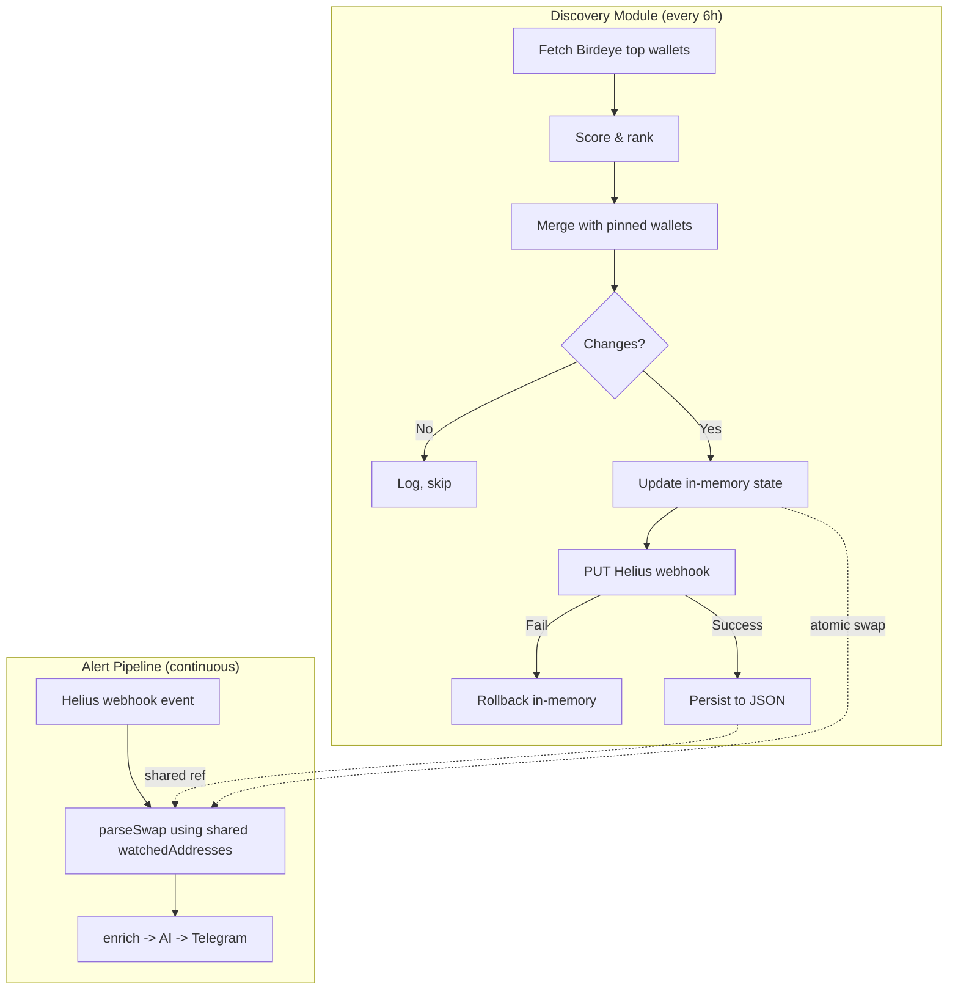

# feat: Auto Smart Money Wallet Discovery via Birdeye API

## Overview

Replace the static 20-wallet configuration with a dynamic discovery system that periodically fetches top-performing Solana wallets from Birdeye API, scores them, and updates the Helius webhook subscription programmatically. The original 20 wallets remain permanently pinned; discovery adds up to 30 more (total cap: 50).

## Problem Frame

The MVP monitors 20 manually curated wallets. This is a ceiling: the best alpha comes from wallets the user hasn't found yet. Manual curation doesn't scale and goes stale as wallet strategies change. Auto-discovery creates a compounding advantage — the system gets smarter over time.

## Requirements Trace

- R1. Periodically discover top-performing Solana wallets from Birdeye API (every 6 hours)
- R2. Score wallets by composite metric: PnL (35%), win rate (30%), trade count (20%), recency (15%)
- R3. Pin the original 20 wallets permanently; discovery adds up to 30 more (total cap 50)
- R4. Dynamically update Helius webhook subscription via PUT API without interrupting the pipeline
- R5. Persist discovered wallet state to survive restarts (JSON file)
- R6. Follow existing graceful degradation patterns: discovery failures never crash the service or block alerts
- R7. Structured logging and observability for discovery cycle outcomes

## Scope Boundaries

- **NOT in scope**: GMGN integration (deferred — undocumented API, Cloudflare-protected; add as enhancement later)
- **NOT in scope**: Web UI for wallet management
- **NOT in scope**: On-chain profitability analysis (complex; Birdeye provides this via API)
- **NOT in scope**: Real-time wallet scoring (batch process on 6h interval is sufficient)

## Context & Research

### Relevant Code and Patterns

- `config/smart-money-addresses.json` — static wallet registry, `Record<address, {label, category}>`
- `src/index.ts` — loads wallets via `readFileSync` at startup into `Map<string, SmartMoneyWallet>`
- `src/pipeline.ts:20` — `const watchedAddresses = new Set(config.walletMap.keys())` captured in closure, **never updated**
- `src/enrichment/enrich.ts` — `Promise.allSettled` + `withTimeout` pattern for external API calls
- `src/env.ts` — Zod-validated env vars; pattern to follow for new vars

### Institutional Learnings

- Fire-and-forget pattern: respond 200 immediately, process async. Discovery must not block the webhook pipeline.
- `Promise.allSettled` for parallel external calls; typed fallback values for every dependency.
- Helius auth is header-echo, not HMAC. Webhook management uses a separate API key as query parameter.
- Pipeline function must never propagate errors.

### External References

- **Birdeye API**: `trader/gainers-losers` for bulk wallet ranking, `wallet/v2/pnl` for per-wallet validation. 30 rpm wallet API cap. Starter tier $99/mo.
- **Helius Webhook API**: `PUT /v0/webhooks/<id>?api-key=<key>` for full address list replacement. Max 100k addresses per webhook. API key as query param.

## Key Technical Decisions

- **Birdeye-only for v1**: GMGN's undocumented API is unreliable. Ship with Birdeye; add GMGN as cross-validation layer in v2 once the core loop is stable. This follows the "ruthless cut" philosophy from the PRD.
- **Mutable wallet state via single-reference swap**: Replace the closure-captured `Set`/`Map` in `pipeline.ts` with a single `WalletState` reference that the discovery module swaps atomically. **Hard invariant: the swap function must be fully synchronous (zero `await` between assignments).** JavaScript's single-threaded nature guarantees no partial reads when assignments are synchronous. Prefer swapping one reference (`state = newSnapshot`) over mutating two properties, making atomicity structural rather than contractual. In-flight transactions that captured the old reference continue using it safely (consistent snapshot behavior).
- **In-memory-first update ordering**: Update the pipeline's wallet state first (so it's ready for new wallets), then PUT to Helius. If PUT fails, roll back by restoring the previous snapshot reference (`state = previousSnapshot`). This means a brief window where the pipeline recognizes wallets Helius isn't sending yet (harmless no-op), avoiding the reverse scenario where Helius sends events the pipeline silently drops.
- **JSON file persistence (atomic write)**: Write to temp file, then `renameSync`. On startup, load discovery state **synchronously before pipeline creation** so the pipeline starts with the full wallet set (pinned + discovered). Fall back to static config on parse error. No database needed at this scale.
- **Grace period for wallet removal**: Wallets that drop from the ranked list are kept for 2 consecutive discovery cycles (12 hours) before removal. Prevents oscillation from a single bad data point.
- **`setInterval` for scheduling with concurrency guard**: No cron library needed. Simple `setInterval` in the main process. `runCycle` has a guard flag (`let running = false`) to prevent overlapping cycles. First cycle runs after 30s debounce on startup (avoids hammering APIs during crash-restart loops); if persisted state is recent (< 6h), wait remaining interval.
- **Discovered wallet labeling**: Discovered wallets get `label: "Birdeye #${rank}"` and `category: "discovered"` to distinguish them from pinned wallets in Telegram alerts and AI prompts.
- **`HELIUS_API_KEY` vs `HELIUS_AUTH_TOKEN` distinction**: `HELIUS_AUTH_TOKEN` (existing) is the secret Helius echoes in the Authorization header on incoming webhooks. `HELIUS_API_KEY` (new) is the API key for managing webhooks programmatically. These are different credentials for different purposes.

## Open Questions

### Resolved During Planning

- **Q: How many Birdeye API calls per discovery cycle?** Resolution: Use `trader/gainers-losers` endpoint (1-2 calls for ranked list), then `wallet/v2/pnl` for top 50 candidates (~50 calls at 30/min = ~2 min). Total cycle: ~2-3 minutes.
- **Q: Should we use the Helius Node.js SDK?** Resolution: No. The REST API is simple (5 endpoints). Native `fetch()` matches existing patterns. Avoids a dependency.
- **Q: Where to store the Helius webhookID?** Resolution: Persist in discovery state JSON. Also discoverable via `GET /v0/webhooks` at startup.

### Deferred to Implementation

- **Exact Birdeye response shape for `trader/gainers-losers`**: Need to call the endpoint and inspect. The scoring normalization depends on actual field names and value ranges.
- **Birdeye pagination**: May need to page through results if the endpoint returns limited results per call.
- **Scoring threshold tuning**: The minimum composite score for inclusion will need empirical tuning after seeing real Birdeye data.

## High-Level Technical Design

> *This illustrates the intended approach and is directional guidance for review, not implementation specification. The implementing agent should treat it as context, not code to reproduce.*

## Implementation Units

- [ ] **Unit 0: Environment and Configuration**

  **Goal:** Add all new env vars and update config before building clients that consume them.

  **Requirements:** R1, R4

  **Dependencies:** None (must run first)

  **Files:**
  - Modify: `src/env.ts`
  - Modify: `.env.example`
  - Modify: `.env`
  - Modify: `CLAUDE.md` (add discovery to project structure)

  **Approach:**
  - New required env vars: `HELIUS_API_KEY`, `BIRDEYE_API_KEY`
  - New optional env vars: `HELIUS_WEBHOOK_ID` (auto-discovered if not set), `DISCOVERY_INTERVAL_MS` (default 21600000 = 6h), `DISCOVERY_WALLET_CAP` (default 30)
  - Document the `HELIUS_AUTH_TOKEN` vs `HELIUS_API_KEY` distinction in `.env.example` comments
  - Update CLAUDE.md project structure to include `src/discovery/`

  **Test expectation:** none — pure configuration, validated by Zod at startup

  **Verification:**
  - Service starts cleanly with all new env vars
  - Service fails fast with descriptive error if required vars are missing

- [ ] **Unit 1: Mutable Pipeline Wallet State**

  **Goal:** Refactor the pipeline to use a shared, swappable wallet state instead of closure-captured immutable `Set`/`Map`.

  **Requirements:** R4

  **Dependencies:** None

  **Files:**
  - Modify: `src/pipeline.ts`
  - Modify: `src/types.ts`
  - Modify: `src/index.ts`
  - Test: `test/pipeline.test.ts`

  **Approach:**
  - Define a `WalletState` type: `{ walletMap: Map<string, SmartMoneyWallet>; watchedAddresses: Set<string> }`
  - Hold a single mutable reference: `{ current: WalletState }`. The pipeline reads `ref.current.walletMap` and `ref.current.watchedAddresses` on every call.
  - Swap is a single synchronous assignment: `ref.current = newSnapshot`. This is structurally atomic — no possibility of partial reads.
  - `createPipeline` accepts the ref object. `processTransaction` dereferences it on each call (not captured at creation time).
  - Export a `createWalletState(wallets)` helper that builds a `WalletState` from a wallet record.
  - Discovered wallets use `label: "Birdeye #${rank}"`, `category: "discovered"` — distinct from pinned wallets.

  **Patterns to follow:**
  - `createPipeline` factory pattern in `src/pipeline.ts`
  - `SmartMoneyWallet` type in `src/types.ts`

  **Test scenarios:**
  - Happy path: pipeline processes a transaction from the initial wallet set
  - Happy path: after `updateWalletState` adds a new wallet, pipeline processes transactions from the new wallet
  - Edge case: after `updateWalletState` removes a wallet, pipeline rejects transactions from the removed wallet
  - Integration: wallet state update mid-processing does not crash in-flight transactions

  **Verification:**
  - All existing pipeline tests still pass
  - New tests demonstrate hot-swappable wallet state

- [ ] **Unit 2: Helius Webhook Management Client**

  **Goal:** Build a thin API client for Helius webhook CRUD operations using native `fetch()`.

  **Requirements:** R4

  **Dependencies:** None (parallel with Unit 1)

  **Files:**
  - Create: `src/discovery/helius-webhooks.ts`
  - Modify: `src/types.ts` (add `HeliusWebhook`, `HeliusWebhookConfig` types)
  - Modify: `src/env.ts` (add `HELIUS_API_KEY`, `HELIUS_WEBHOOK_ID` optional)
  - Modify: `.env.example`
  - Test: `test/discovery/helius-webhooks.test.ts`

  **Approach:**
  - Functions: `listWebhooks`, `getWebhook`, `updateWebhookAddresses` (GET current, merge, PUT full replacement)
  - All calls use `withTimeout` from existing enrichment pattern
  - `HELIUS_API_KEY` is mandatory for discovery; `HELIUS_WEBHOOK_ID` is optional (auto-discovered via `listWebhooks` at startup)

  **Patterns to follow:**
  - `src/enrichment/dexscreener.ts` for API client structure (native fetch, timeout, error handling)
  - `src/env.ts` Zod schema for new env vars

  **Test scenarios:**
  - Happy path: `updateWebhookAddresses` sends PUT with merged address list
  - Happy path: `listWebhooks` returns array, client extracts correct webhook by URL match
  - Error path: Helius returns 429 — client throws, does not crash
  - Error path: Helius returns 500 — client throws with descriptive error
  - Edge case: timeout fires before response — client throws timeout error
  - Edge case: empty address list — PUT still succeeds (Helius accepts it)

  **Verification:**
  - Client methods are testable with mocked fetch
  - Error cases return typed errors, never crash

- [ ] **Unit 3: Birdeye Wallet Discovery Client**

  **Goal:** Build the Birdeye API client that fetches top-performing wallets and their PnL data.

  **Requirements:** R1, R2

  **Dependencies:** None (parallel with Units 1, 2)

  **Files:**
  - Create: `src/discovery/birdeye.ts`
  - Modify: `src/types.ts` (add `BirdeyeWallet`, `WalletCandidate` types)
  - Modify: `src/env.ts` (add `BIRDEYE_API_KEY`)
  - Modify: `.env.example`
  - Test: `test/discovery/birdeye.test.ts`

  **Approach:**
  - `fetchTopWallets()`: call `trader/gainers-losers` endpoint, return ranked wallet list
  - `fetchWalletPnL(address)`: call `wallet/v2/pnl` for individual wallet validation
  - Both use `withTimeout`, rate limiter (simple token bucket for 30 rpm cap)
  - Response normalization: map Birdeye fields to internal `WalletCandidate` type

  **Patterns to follow:**
  - `src/enrichment/dexscreener.ts` for API client pattern
  - `src/enrichment/enrich.ts` for `withTimeout` usage

  **Test scenarios:**
  - Happy path: `fetchTopWallets` returns normalized wallet list with PnL, win rate, trade count
  - Happy path: `fetchWalletPnL` returns detailed PnL for a single wallet
  - Error path: Birdeye returns 401 (bad API key) — descriptive error
  - Error path: Birdeye returns 429 (rate limited) — throws, doesn't crash
  - Error path: timeout on slow response — throws timeout error
  - Edge case: empty results from Birdeye — returns empty array, no error

  **Verification:**
  - Client methods return typed data, all errors are handled
  - Rate limiter prevents exceeding 30 rpm

- [ ] **Unit 4: Wallet Scoring Engine**

  **Goal:** Score and rank wallet candidates using the composite metric, with pinned wallet support and grace period for removals.

  **Requirements:** R2, R3

  **Dependencies:** Unit 3 (uses `WalletCandidate` type)

  **Files:**
  - Create: `src/discovery/scoring.ts`
  - Test: `test/discovery/scoring.test.ts`

  **Approach:**
  - `scoreWallets(candidates, pinnedAddresses, currentDiscovered)`: returns ranked list with composite scores
  - Composite: PnL (35%) + win rate (30%) + trade count (20%) + recency (15%)
  - Normalize each metric to 0-1 scale using percentile ranking within the candidate set
  - Pinned wallets always included regardless of score
  - Grace period: track `missedCycles` per wallet. Increment on absence, reset on presence. Remove after 2 consecutive misses.
  - Cap at 30 discovered wallets (50 total with 20 pinned)

  **Patterns to follow:**
  - Pure functions, no side effects. Testing is straightforward.

  **Test scenarios:**
  - Happy path: 50 candidates scored, top 30 selected, sorted by composite
  - Happy path: pinned wallets always appear in output regardless of score
  - Happy path: wallet with cross-validation (future: both sources) gets confidence boost
  - Edge case: fewer than 30 candidates — all included, no error
  - Edge case: all candidates have identical scores — stable sort, no crash
  - Edge case: wallet absent for 1 cycle — still in list (grace period)
  - Edge case: wallet absent for 2 cycles — removed from discovered list
  - Edge case: wallet returns after 1 absence — `missedCycles` resets to 0

  **Verification:**
  - Scoring is deterministic: same input always produces same ranking
  - Grace period logic is tested at the boundary (1 miss = keep, 2 misses = remove)

- [ ] **Unit 5: Discovery Orchestrator**

  **Goal:** Tie together Birdeye client, scoring engine, Helius webhook update, and persistence into a single discovery cycle with scheduling.

  **Requirements:** R1, R4, R5, R6, R7

  **Dependencies:** Units 1, 2, 3, 4

  **Files:**
  - Create: `src/discovery/orchestrator.ts`
  - Modify: `src/index.ts` (initialize and start discovery)
  - Create: `src/discovery/persistence.ts` (atomic JSON read/write)
  - Test: `test/discovery/orchestrator.test.ts`
  - Test: `test/discovery/persistence.test.ts`

  **Approach:**
  - `createDiscovery(config)` factory, returns `{ start, stop, runCycle }`
  - **Concurrency guard**: `let running = false` flag on `runCycle`. If already running, skip and log.
  - `runCycle()`:
    1. Fetch Birdeye top wallets
    2. Score and rank (include pinned, apply grace period)
    3. Diff against current state
    4. If changes: save previous snapshot, update in-memory pipeline state, then PUT Helius webhook
    5. If Helius PUT fails: restore previous snapshot (`ref.current = previousSnapshot`), log error
    6. If success: persist to `config/discovered-wallets.json`, log summary
  - **Startup ordering** (critical):
    1. Load persisted state synchronously from `config/discovered-wallets.json` (fall back to pinned-only on error)
    2. Merge pinned + discovered wallets, create initial `WalletState`
    3. Create pipeline with merged state
    4. Start Fastify server (accept webhooks immediately)
    5. Schedule first discovery cycle (30s debounce if no recent state; remaining interval if recent)
  - `stop()`: clear interval (for graceful shutdown)
  - Persistence: atomic write (write temp, `renameSync`). On Railway, filesystem is ephemeral across redeploys (not restarts) — discovery re-converges within 6h.
  - Structured logging: wallets evaluated, added, removed, cycle duration, API errors
  - Optional: extend `/health` to include discovery metadata (last cycle time, wallet count, status)

  **Patterns to follow:**
  - `createPipeline` factory pattern for `createDiscovery`
  - `Promise.allSettled` for concurrent Birdeye calls
  - `withTimeout` on all external calls
  - Fire-and-forget pattern: discovery errors logged, never propagated

  **Test scenarios:**
  - Happy path: full cycle — fetch, score, diff, update pipeline state, update Helius, persist
  - Happy path: no changes detected — skips Helius update, logs "no changes"
  - Error path: Birdeye API fails — keeps current wallet list, logs warning
  - Error path: Helius PUT fails — rolls back in-memory state, logs error
  - Error path: JSON persistence fails — in-memory state still correct, next cycle retries
  - Edge case: first run with no persisted state — runs immediately after debounce
  - Edge case: recent persisted state — schedules for remaining interval
  - Edge case: corrupted persisted JSON — falls back to pinned-only
  - Integration: pipeline continues processing during discovery cycle without interruption

  **Verification:**
  - Discovery cycle completes without affecting pipeline uptime
  - Helius webhook is updated only when wallet list actually changes
  - Persisted state survives process restart

## System-Wide Impact

- **Interaction graph:** Discovery module swaps a single `WalletState` reference read by `pipeline.processTransaction`. No callbacks or middleware affected. The webhook handler (`src/webhook/handler.ts`) is unchanged.
- **Error propagation:** Discovery errors are self-contained (logged, never thrown). Pipeline errors are unchanged (per-transaction `.catch()`). The two systems are decoupled via the shared state reference.
- **State lifecycle risks:** The in-memory wallet state and persisted JSON file can drift if persistence fails. Mitigated by: (a) re-reading persisted state on startup, (b) next cycle re-converges both. Railway's ephemeral filesystem means persistence does not survive redeploys (only restarts) — acceptable since discovery re-converges within 6h.
- **API surface parity:** No external API changes. Telegram alert format will show new wallet labels (`"Birdeye #1"` with `category: "discovered"`) alongside existing pinned wallet labels.
- **Dedup interaction:** When wallets are re-added after grace period removal, the 60s TTL dedup means already-processed transactions will not be reprocessed (non-issue at 6h cycle intervals).
- **Unchanged invariants:** The webhook handler, dedup, enrichment, AI attribution, and Telegram delivery are completely untouched. The only pipeline change is reading wallet state from a swappable reference instead of a closure-captured constant.
- **API client convention:** New clients (`birdeye.ts`, `helius-webhooks.ts`) export standalone async functions (not classes), matching `dexscreener.ts` pattern. Credentials passed as function parameters, matching `sendAlert`/`generateAttribution` pattern.

## Risks & Dependencies

| Risk | Mitigation |
|------|------------|
| Birdeye API down or rate limited during discovery | Keep current wallet list unchanged. Log warning. Retry on next scheduled cycle. Pipeline unaffected. |
| Birdeye pricing changes or API deprecation | Birdeye is actively maintained (last update Aug 2025). $99/mo Starter tier is budgeted. Monitor changelogs. |
| Helius webhook PUT fails | Roll back in-memory state. Pipeline continues with previous wallet list. Log error for manual investigation. |
| Discovery selects low-quality wallets | Grace period (2 cycles) prevents oscillation. Pinned wallets provide baseline quality. Scoring thresholds are tunable. |
| JSON persistence corruption | Atomic write (temp + rename). On read failure, fall back to pinned-only config. No data loss beyond last cycle. |
| Crash-restart loop hammers APIs | 30s debounce before first discovery cycle. Skip if recent state exists. |
| Concurrent discovery cycles (slow cycle + next interval fires) | Guard flag on `runCycle` prevents overlapping execution. Second cycle skipped and logged. |
| Railway ephemeral filesystem loses persisted state on redeploy | Discovery re-converges within 6h. Acceptable for current scale. Volume mount if persistence across deploys needed later. |

## Documentation / Operational Notes

- **New cost**: Birdeye Starter tier at $99/mo
- **New env vars**: `HELIUS_API_KEY`, `BIRDEYE_API_KEY` must be configured on Railway
- **Monitoring**: Discovery cycle outcomes visible in structured logs. Future: Sentry alert on 3+ consecutive discovery failures.
- **Rollback**: Set `DISCOVERY_INTERVAL_MS=0` to disable discovery and run with pinned-only wallets.

## Sources & References

- Birdeye API docs: `docs.birdeye.so` (trader/gainers-losers, wallet/v2/pnl, rate limits, pricing)
- Helius Webhook API: `PUT /v0/webhooks/<id>?api-key=<key>` (full replacement, max 100k addresses)
- Existing patterns: `src/enrichment/enrich.ts` (Promise.allSettled + withTimeout), `src/enrichment/dexscreener.ts` (API client pattern)
- PRD: `docs/solutions/documentation-gaps/smart-money-radar-mvp-prd-v1-1-2026-03-31.md` (wallet discovery was Phase 3 scope)
- Graceful degradation: `docs/solutions/best-practices/fire-and-forget-webhook-graceful-degradation-2026-03-31.md`
