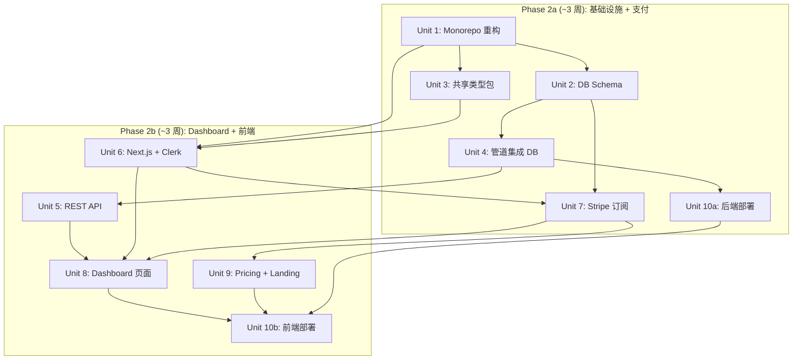

# Phase 2 MLP — Web Dashboard + 用户订阅系统

## Overview

将 Smart Money Radar 从 Telegram-only MVP 演进为带 Web Dashboard 的 MLP（最小可盈利产品）。新增：Next.js 前端、Clerk 用户认证、Stripe 订阅支付、PostgreSQL 数据持久化、pnpm monorepo 重构。目标：自动化获客与支付闭环，50 个付费用户，$5,000 MRR。

## Problem Frame

Phase 1 MVP 通过 Telegram 私密频道 + 手动邀请验证了核心需求（10 个死忠粉 + $1,000 MRR）。但手动收款和拉群不可扩展——每新增一个用户都需要人工操作。Phase 2 解决的核心问题是：**让获客和支付全自动化**，同时提供基础 Web Dashboard 让用户查看历史告警和管理订阅。

**范围扩展决策**：PRD 原定 Phase 2 仅含"支付网关 + 基础用户管理"，完整 Dashboard 属于 Phase 3。本计划提前引入**最小化** Dashboard（只读告警历史 + 钱包详情），类似 Phase 1 中自动钱包发现提前落地的模式。Dashboard 定位为**历史分析和搜索**（Telegram 无法提供的能力），而非实时告警镜像。自定义监听和 EVM 多链仍严格保留在 Phase 3。

**验证标准**：如果支付自动化上线后前 10 个付费用户在 2 周内不主动要求 Dashboard 功能，则将 Dashboard（Phase 2b）推迟到 Phase 3，Phase 2 仅交付支付闭环（Phase 2a）。

**时间线调整**：原 4 周拆分为 Phase 2a（Units 1-4+7, ~3 周：基础设施 + 后端 + 支付）和 Phase 2b（Units 5-6+8-10, ~3 周：REST API + 前端 + Dashboard + 部署）。Phase 2a 完成即可验证支付闭环。

## Requirements Trace

- R1. 用户可通过 Web 页面注册/登录（Clerk 认证）
- R2. 用户可通过 Stripe Checkout 订阅 $100/月套餐
- R3. 订阅生命周期自动管理（续费、降级、取消、欠费）
- R4. 付费用户可查看实时告警 Dashboard（与 Telegram 同源数据）
- R5. 付费用户可查看告警历史记录（分页）
- R6. 付费用户可查看被监控钱包详情（地址、评分、发现来源）
- R7. 所有告警持久化到 PostgreSQL（Telegram 推送仍是主渠道）
- R8. 定价页面展示套餐信息，引导注册/支付
- R9. 前端严格遵循暗色加密终端设计风格（见 `docs/solutions/best-practices/phased-frontend-design-philosophy-2026-03-31.md`）
- R10. 现有 Telegram 告警管道不受影响（数据库写入失败不阻断推送）
- R11. 部署方案：Vercel（前端）+ Railway（后端）
- R12. Monorepo 重构：pnpm workspaces 管理前后端 + 共享包

## Scope Boundaries

**在范围内**：
- 注册/登录/订阅支付流程
- 只读 Dashboard（告警列表、钱包列表、钱包详情）
- 告警历史持久化
- Stripe 客户门户（管理订阅/取消/更新支付方式）
- 暗色终端风格 UI

**不在范围内（严格保留 Phase 3）**：
- 自定义钱包监听（用户添加自己的地址）
- EVM 多链支持
- 实时 WebSocket 推送到 Dashboard（Phase 2 用 SSR + 短间隔 revalidate）
- 高级分析（胜率、PNL 图表、回测）
- 加密货币支付（Phase 2 仅 Stripe 法币）
- 多套餐/分层定价（Phase 2 仅 $100/月单一套餐）

## Context & Research

### Relevant Code and Patterns

- **管道架构** (`src/pipeline.ts`): fire-and-forget 模式，dedup → parse → enrich → AI → format → send。Phase 2 在 enrich 之后插入 DB 写入
- **Factory 函数模式**: `createPipeline(config)`, `createDiscovery(config)` — 新服务遵循同样模式
- **Zod 环境变量验证** (`src/env.ts`): Phase 2 扩展 schema 添加新变量
- **优雅降级**: `Promise.allSettled` + `withTimeout` — DB 写入同样需要超时和降级
- **WalletStateRef 原子切换** (`src/types.ts`): 内存状态先于外部系统更新的模式继续适用
- **类型系统** (`src/types.ts`): `AlertData`, `ParsedSwap`, `EnrichmentResult`, `WalletCandidate` 等核心类型需提取到共享包

### Institutional Learnings

- **优雅降级复合效应** (see `docs/solutions/best-practices/fire-and-forget-webhook-graceful-degradation-2026-03-31.md`): DB 写入失败绝不阻断 Telegram 推送
- **Payload 真实性** (see `docs/solutions/runtime-errors/parseswap-helius-payload-mismatch-2026-03-31.md`): DB schema 必须基于真实 Helius payload 建模
- **前端设计哲学** (see `docs/solutions/best-practices/phased-frontend-design-philosophy-2026-03-31.md`): 暗色终端风格，JetBrains Mono 等宽字体，禁止 SaaS 模板
- **Phase gates**: 前端设计哲学文档规定 Phase 2 启用前端，必须走 `/frontend-design` → 实现 → `/impeccable` 工作流

### External References

- Clerk Next.js 集成: `clerkMiddleware()` + `createRouteMatcher()` 保护路由
- Clerk 暗色主题: `appearance.baseTheme: dark` + 自定义 CSS 变量
- Clerk Webhook 验证: 2026 年推荐 `verifyWebhook()` 内置函数
- Stripe 订阅: 5 个核心 webhook 事件 (`checkout.session.completed`, `invoice.paid`, `invoice.payment_failed`, `customer.subscription.updated`, `customer.subscription.deleted`)
- Stripe Customer Portal: 用户自助管理订阅，避免自建复杂 UI
- Neon PostgreSQL: HTTP 驱动（Vercel 无服务器）+ Pool 驱动（Railway 长连接）
- Drizzle ORM: 类型安全 schema 定义 + 迁移
- pnpm workspaces + Turborepo: monorepo 管理

## Key Technical Decisions

- **数据库选择 Neon PostgreSQL**: 内置连接池，HTTP 驱动适配 Vercel 无服务器环境，Drizzle 原生支持。Railway 端用 Pool 长连接。（替代方案 Supabase 过重，自建 PostgreSQL 缺少 serverless 适配）

- **ORM 选择 Drizzle**: 类型安全 schema-first，迁移工具内置，轻量无运行时开销。（替代方案 Prisma 2026 年仍有冷启动问题，对 serverless 不友好）

- **认证选择 Clerk**: 开箱即用的 Next.js 集成，内置暗色主题可定制，webhook 同步用户到本地 DB。（替代方案 Auth.js/NextAuth 需要更多自建工作，Supabase Auth 绑定 Supabase 生态）

- **Webhook 路由分离**: Clerk/Stripe webhook 落在 Vercel 端（Next.js Route Handler），Helius webhook 保持在 Railway 端（Fastify）。理由：Clerk/Stripe 处理用户计费逻辑，与前端同部署；Helius 处理链上数据，与后端同部署

- **前后端通信用 REST + 共享类型包**: 不用 tRPC（两个独立服务分别部署，tRPC 适合 Next.js 内部 API Routes）。`@radar/shared` 包通过 `workspace:*` 引用确保类型一致

- **单一套餐 $100/月**: Phase 2 不做分层定价，降低 Stripe 集成复杂度。套餐信息作为 `@radar/shared/constants/plans.ts` 常量定义，不建 `plans` 数据库表（Phase 3 多套餐时再加表）

- **Phase 2 仅 Stripe 法币支付**: PRD 原含"Stripe/Crypto 支付"，加密货币支付推迟到 Phase 3。理由：Solana Pay / Crypto 支付集成复杂度高，且 $100/月 Stripe 信用卡支付对目标用户可接受，优先验证支付闭环而非支付方式多样性

- **Phase 2 不做实时 WebSocket**: Dashboard 用 Next.js ISR/SSR + 30 秒 revalidate。"Dashboard 不能比 Telegram 慢"这一要求在 Phase 3 用 WebSocket/SSE 实现；Phase 2 可接受 30 秒延迟，因为核心实时渠道仍是 Telegram

- **Monorepo 结构**: pnpm workspaces（`apps/web`, `apps/backend`, `packages/shared`, `packages/db`）。不引入 Turborepo 除非构建时间成为瓶颈

## Open Questions

### Resolved During Planning

- **Q: DB 写入应该同步还是异步？** → 异步。作为 `Promise.allSettled` 的一个分支加入管道，失败不阻断 Telegram 推送。这延续了现有优雅降级模式
- **Q: 前端用 Pages Router 还是 App Router？** → App Router。2026 年 Next.js 15 的 App Router 已稳定，Server Components + Server Actions 是推荐模式
- **Q: 用户删除账号时如何处理？** → Clerk `user.deleted` webhook 先调用 `stripe.subscriptions.cancel()` 取消活跃订阅（防止孤立扣款），然后软删除用户记录（`deletedAt` 字段）。订阅记录保留用于审计，标记 `status: 'canceled'`。不使用硬删除 + cascade，因为支付记录需要留存
- **Q: 免费试用？** → Phase 2 不做。$100/月 单一套餐，直接 Checkout。Phase 3 可考虑 7 天试用

### Deferred to Implementation

- **Neon 双连接字符串**: Vercel 用 `DATABASE_URL`（neon serverless HTTP 驱动），Railway 用 `DATABASE_POOL_URL`（neon pooler WebSocket/TCP 驱动）。两个是不同的环境变量和不同的 endpoint URL。具体格式在部署时确认
- **Stripe 测试模式到生产模式的切换**: 涉及 webhook endpoint 和 price ID 更新，部署阶段处理
- **Clerk 暗色主题的具体 CSS 变量值**: 需要与设计系统对齐，实现时通过 `/frontend-design` 确定
- **Railway 的 monorepo watch paths 配置**: 具体配置格式在部署时确认

## High-Level Technical Design

> *This illustrates the intended approach and is directional guidance for review, not implementation specification. The implementing agent should treat it as context, not code to reproduce.*

### 系统架构总览

```
┌─────────────────────────────────────────────────────────────┐
│                    用户浏览器                                 │
│  Landing Page ─── Pricing ─── Dashboard ─── Wallet Detail   │
└──────────────────────┬──────────────────────────────────────┘
                       │
                       ▼
┌──────────────────────────────────────────────┐
│           Vercel (Next.js 15 App Router)     │
│  ┌─────────────┐  ┌──────────────────────┐   │
│  │ Clerk Auth  │  │ Server Actions/SSR   │   │
│  │ Middleware   │  │ (读取 DB + 调后端)   │   │
│  └─────────────┘  └──────────────────────┘   │
│  ┌─────────────┐  ┌──────────────────────┐   │
│  │ /api/webhooks│  │ Stripe Checkout     │   │
│  │ /clerk      │  │ Customer Portal     │   │
│  │ /stripe     │  └──────────────────────┘   │
│  └─────────────┘                              │
└──────────┬────────────────────┬──────────────┘
           │                    │
           ▼                    ▼
┌──────────────────┐   ┌───────────────────────────────────┐
│ Neon PostgreSQL  │   │      Railway (Fastify)             │
│ ┌──────────────┐ │   │  ┌─────────────────────────────┐  │
│ │ users        │ │◄──│──│ Pipeline: Helius → Enrich   │  │
│ │ subscriptions│ │   │  │ → AI → Format → Telegram    │  │
│ │ alerts       │ │   │  │ → DB Write (async, 降级)    │  │
│ │ wallets      │ │   │  └─────────────────────────────┘  │
│ └──────────────┘ │   │  ┌─────────────────────────────┐  │
│                  │   │  │ Discovery: Birdeye → Score   │  │
│                  │   │  │ → Hot-swap → DB Persist      │  │
│                  │   │  └─────────────────────────────┘  │
│                  │   │  ┌─────────────────────────────┐  │
│                  │   │  │ REST API: /api/alerts,       │  │
│                  │   │  │ /api/wallets (API Key auth)  │  │
│                  │   │  └─────────────────────────────┘  │
└──────────────────┘   └───────────────────────────────────┘
```

### 数据流

```
[Helius Webhook]
      │
      ▼
[Fastify: auth + 200 OK + fire-and-forget]
      │
      ▼
[dedup → parseSwap → enrichToken]
      │
      ▼
[generateAttribution] (1s timeout, empty fallback)
      │
      ├──── [Promise.allSettled] ────┐
      │                              │
      ▼                              ▼
[formatAlert → sendAlert]     [DB: insert alert]
   (Telegram)                  (含 aiSummary, timeout 2s,
                                failure → log only)
```

## Implementation Units

### Phase A: 基础设施（Unit 1-3）

- [x] **Unit 1: Monorepo 重构 — pnpm workspaces**

  **Goal:** 将现有单体项目重构为 pnpm workspaces monorepo，支持前后端独立开发和部署

  **Requirements:** R12

  **Dependencies:** None（第一个 unit，后续所有 unit 依赖此结构）

  **Files:**
  - Create: `pnpm-workspace.yaml`
  - Create: `apps/backend/package.json`
  - Create: `apps/web/package.json`
  - Create: `packages/shared/package.json`
  - Create: `packages/shared/src/index.ts`
  - Create: `packages/db/package.json`
  - Create: `packages/db/src/index.ts`
  - Modify: `package.json`（根级，变为 workspace root）
  - Modify: `tsconfig.json`（根级，变为 tsconfig.base.json 或添加 references）
  - Create: `apps/backend/tsconfig.json`（继承根级 tsconfig，设置 rootDir/include 相对于 backend 包）
  - Move: `src/` → `apps/backend/src/`
  - Move: `test/` → `apps/backend/test/`
  - Move: `config/` → `apps/backend/config/`
  - Test: `apps/backend/test/` (现有测试全部通过)

  **Approach:**
  - 根 `package.json` 仅保留 devDependencies（typescript, prettier, eslint）
  - `apps/backend/` 继承现有所有 dependencies 和 scripts
  - `packages/shared/` 包名 `@radar/shared`，导出域类型（从现有 `types.ts` 提取）
  - `packages/db/` 包名 `@radar/db`，后续 Unit 2 填充
  - 使用 `workspace:*` 协议引用内部包
  - **路径审计（关键）**：`src/index.ts` 中使用 `import.meta.dirname` + 相对路径 `'../config/...'` 加载 JSON 配置。移动到 `apps/backend/src/` 后，`config/` 目录也同步移动到 `apps/backend/config/`，相对路径 `../config/` 仍然正确。必须在移动后显式验证所有 `import.meta.dirname` 引用路径
  - 验证 `pnpm install` 和现有 `pnpm test` 仍正常工作

  **Patterns to follow:**
  - 现有 `package.json` 的 ESM 配置（`"type": "module"`）
  - pnpm workspaces 标准实践

  **Test scenarios:**
  - Happy path: `pnpm install` 成功解析所有 workspace 依赖
  - Happy path: `pnpm --filter backend test` 通过所有现有测试（零回归）
  - Happy path: `pnpm --filter backend typecheck` 类型检查通过
  - Happy path: `apps/backend/src/types.ts` 可从 `@radar/shared` 导入共享类型
  - Edge case: 根目录 `pnpm test` 也能触发 backend 测试

  **Verification:**
  - 所有现有测试通过，无类型错误
  - `pnpm --filter @radar/shared build`（或 typecheck）成功
  - workspace 依赖图正确（`pnpm list --depth 0` 在各 workspace 显示正确依赖）

---

- [x] **Unit 2: 数据库 Schema + 迁移 — Neon PostgreSQL + Drizzle**

  **Goal:** 建立 PostgreSQL 数据库 schema，包含 users、subscriptions、alerts_history、tracked_wallets 表

  **Requirements:** R1, R2, R3, R7

  **Dependencies:** Unit 1

  **Files:**
  - Create: `packages/db/src/schema/users.ts`
  - Create: `packages/db/src/schema/subscriptions.ts`
  - Create: `packages/db/src/schema/alerts.ts`
  - Create: `packages/db/src/schema/wallets.ts`
  - Create: `packages/db/src/schema/index.ts`
  - Create: `packages/db/src/client.ts` (HTTP 客户端 for Vercel)
  - Create: `packages/db/src/client.pool.ts` (Pool 客户端 for Railway)
  - Create: `packages/db/drizzle.config.ts`
  - Create: `packages/db/tsconfig.json`
  - Test: `packages/db/test/schema.test.ts`

  **Approach:**
  - **users 表**: id (cuid2), clerkId (unique), email, name, stripeCustomerId (unique, nullable), **deletedAt (nullable timestamp, 软删除)**, timestamps。不使用硬删除——支付审计需要保留用户记录
  - **subscriptions 表**: id, userId (FK → users, **不用 cascade**), stripeSubscriptionId (unique), stripePriceId, status (enum: active/past_due/canceled/incomplete/trialing/paused), currentPeriodStart, currentPeriodEnd, cancelAtPeriodEnd, timestamps。用户软删除时订阅标记 canceled 但记录保留
  - **alerts_history 表**: id, signature (unique, 用于去重), **userId (nullable FK → users, Phase 2 始终为 null, 为 Phase 3 自定义钱包预留)**, walletAddress, walletLabel, tokenMint, tokenSymbol, dexSource, amountRaw, liquidity, fdv, marketCap, mintAuthority, freezeAuthority, aiSummary, telegramSent (boolean), createdAt。Phase 2 是全局告警记录（单一频道），Phase 3 通过 userId 支持多租户
  - **tracked_wallets 表**: id, address (unique), label, category, source (enum: pinned/discovered), compositeScore, winRate, pnl, tradeCount, isActive, lastDiscoveredAt, timestamps
  - **双客户端 + 双连接字符串**: `client.ts` 用 `neon()` HTTP 驱动，读 `DATABASE_URL` 环境变量（给 Vercel）；`client.pool.ts` 用 `Pool` WebSocket 驱动，读 `DATABASE_POOL_URL` 环境变量（给 Railway）。Neon 的 HTTP endpoint 和 Pooler endpoint 是不同的 URL
  - 首次迁移通过 `drizzle-kit generate` + `drizzle-kit migrate` 执行

  **Patterns to follow:**
  - 现有 `types.ts` 中的域类型定义（`AlertData`, `WalletCandidate` 等）— schema 字段对齐
  - Zod 验证模式 — 考虑用 `createInsertSchema` 从 Drizzle schema 生成 Zod validators

  **Test scenarios:**
  - Happy path: Schema 定义通过类型检查，所有字段类型正确
  - Happy path: `drizzle-kit generate` 生成有效的 SQL 迁移文件
  - Happy path: 插入一条 user 记录后可查询到
  - Happy path: 插入 alert 记录（含所有 nullable 字段为 null）成功
  - Edge case: alerts_history.signature 唯一约束阻止重复插入
  - Edge case: 软删除 user（设置 deletedAt）→ subscriptions 记录保留，status 改为 canceled
  - Edge case: alerts_history.userId 为 null 时插入成功（Phase 2 默认行为）
  - Integration: tracked_wallets 表的 source enum 接受 'pinned' 和 'discovered'

  **Verification:**
  - 迁移文件生成且可执行
  - schema 类型与 `@radar/shared` 中的域类型对齐
  - 双客户端均可连接（本地开发用 Neon 的免费层或 Docker PostgreSQL）

---

- [x] **Unit 3: 共享类型包 — @radar/shared**

  **Goal:** 从现有 `types.ts` 提取共享域类型到独立包，前后端共用

  **Requirements:** R12

  **Dependencies:** Unit 1

  **Files:**
  - Create: `packages/shared/src/types/domain.ts` (从 `apps/backend/src/types.ts` 提取)
  - Create: `packages/shared/src/types/api.ts` (API 请求/响应类型)
  - Create: `packages/shared/src/constants/plans.ts` (套餐定义)
  - Create: `packages/shared/src/constants/index.ts`
  - Create: `packages/shared/src/index.ts` (re-export)
  - Create: `packages/shared/tsconfig.json`
  - Modify: `apps/backend/src/types.ts` (改为从 `@radar/shared` re-export)
  - Test: `packages/shared/test/types.test.ts`

  **Approach:**
  - 域类型（`AlertData`, `ParsedSwap`, `EnrichmentResult`, `SmartMoneyWallet`, `WalletCandidate`）移入 `domain.ts`
  - API 类型（`PaginatedResponse<T>`, `AlertListResponse`, `WalletListResponse`）定义在 `api.ts`
  - 套餐常量（名称、价格、限额）定义在 `plans.ts`
  - `apps/backend/src/types.ts` 改为 `export * from '@radar/shared'` 保持后端代码零改动
  - Helius 特有类型（`HeliusEnhancedTransaction` 等）保留在后端，不共享

  **Patterns to follow:**
  - 现有类型命名约定（PascalCase 接口）
  - 现有 null/fallback 约定（`null` = 数据不可用, `'unchecked'` = 检查失败）

  **Test scenarios:**
  - Happy path: `@radar/shared` 包可被 `apps/backend` 和 `apps/web` 导入
  - Happy path: 后端现有测试全部通过（types re-export 兼容）
  - Happy path: API 类型 `PaginatedResponse<AlertData>` 类型检查通过
  - Edge case: Helius 特有类型不在 shared 包中暴露

  **Verification:**
  - `pnpm --filter backend test` 全部通过
  - `pnpm --filter @radar/shared typecheck` 通过
  - `apps/web` 可 import `@radar/shared` 中的所有公开类型

---

### Phase B: 后端扩展（Unit 4-5）

- [x] **Unit 4: 管道集成 — 告警持久化到 DB**

  **Goal:** 在现有 fire-and-forget 管道中异步写入告警到 PostgreSQL，保持 Telegram 推送不受影响

  **Requirements:** R7, R10

  **Dependencies:** Unit 1, Unit 2

  **Files:**
  - Create: `apps/backend/src/persistence/alerts.ts`（告警写入函数）
  - Create: `apps/backend/src/persistence/wallets.ts`（钱包状态同步函数）
  - Modify: `apps/backend/src/pipeline.ts`（在 enrichToken 后加入 DB 写入分支）
  - Modify: `apps/backend/src/discovery/persistence.ts`（从 JSON 文件迁移到 DB）
  - Modify: `apps/backend/src/env.ts`（添加 DATABASE_URL 环境变量）
  - Test: `apps/backend/test/persistence/alerts.test.ts`
  - Test: `apps/backend/test/pipeline.test.ts`（更新现有测试）

  **Approach:**
  - `persistAlert(db, alertData)` 函数：用 `withTimeout(db.insert(alertsHistory).values(...), 2000)` 包裹，超时或失败仅 log.error
  - 在 `processTransaction` 中，DB 写入在 `generateAttribution` **之后**执行（顺序，非并行），因为 alerts_history 表包含 aiSummary 字段，需要等 AI 结果：
    ```
    const aiSummary = await generateAttribution(...) // 先生成 AI 摘要
    await Promise.allSettled([
      persistAlert(db, { swap, enrichment, aiSummary }),  // 含 AI 摘要写入 DB
      sendAlert(formatAlert({ swap, enrichment, aiSummary }))  // 同时发送 Telegram
    ])
    // DB 写入失败仅 log，不阻断 Telegram
    ```
  - 告警去重升级：`alerts_history.signature` 唯一约束 + INSERT ... ON CONFLICT DO NOTHING
  - 钱包持久化：discovery orchestrator 在更新内存状态后，同步写入 `tracked_wallets` 表（替代 JSON 文件写入）。`loadDiscoveryState`/`saveDiscoveryState` 保持相同接口，仅将底层实现从 fs 替换为 DB
  - **JSON→DB 数据迁移**：启动时检测 — 如果 `tracked_wallets` 表为空但 `discovered-wallets.json` 存在，自动导入现有数据。一次性操作，导入成功后可删除 JSON 文件
  - **Historical Alerts**: Phase 2 alerts_history 表从 Day 1 开始为空。Phase 1 的告警历史保留在 Telegram 频道中，不做自动迁移（解析 Telegram 消息的复杂度不值得）
  - DATABASE_POOL_URL 在 env.ts 中标记为 optional（Phase 1 部署可无 DB 继续运行）
  - **启动策略**：如果 DATABASE_POOL_URL 已配置但 Neon 不可达，后端仍然启动（Telegram 管道是核心），health check 报告 DB 状态为 `degraded`。DB 写入分支在启动时不做强制连接验证

  **Execution note:** 先写一个失败场景的测试（DB 写入超时时 Telegram 推送仍正常），验证优雅降级

  **Patterns to follow:**
  - 现有 `Promise.allSettled` + `withTimeout` 模式 (`src/enrichment/enrich.ts`)
  - 现有 fire-and-forget 错误隔离模式 (`src/webhook/handler.ts`)
  - Factory 函数模式：`createAlertPersistence(config)` 返回 `{ persistAlert }`

  **Test scenarios:**
  - Happy path: 告警成功写入 DB 且 Telegram 推送正常发送
  - Happy path: 钱包发现结果写入 tracked_wallets 表
  - Error path: DB 写入超时（2s）→ Telegram 推送仍正常，error 日志记录
  - Error path: DB 连接失败 → Telegram 推送仍正常，error 日志记录
  - Error path: 重复 signature 插入 → ON CONFLICT DO NOTHING，无报错
  - Integration: 完整管道 Helius → parse → enrich → [AI + DB] → format → send 端到端流程
  - Edge case: DATABASE_URL 未配置时，persistAlert 为空操作（Phase 1 兼容）

  **Verification:**
  - 现有所有管道测试通过
  - DB 写入失败时端到端延迟仍 < 5 秒
  - 告警记录可通过 DB 查询到

---

- [ ] **Unit 5: Fastify REST API 层 — 为前端提供数据接口**

  **Goal:** 在 Fastify 后端新增 REST API 端点，供 Next.js 前端消费告警和钱包数据

  **Requirements:** R4, R5, R6

  **Dependencies:** Unit 2, Unit 4

  **Files:**
  - Create: `apps/backend/src/api/routes.ts`（API 路由注册）
  - Create: `apps/backend/src/api/auth.ts`（API Key 认证插件）
  - Create: `apps/backend/src/api/alerts.ts`（GET /api/alerts — 分页列表）
  - Create: `apps/backend/src/api/wallets.ts`（GET /api/wallets — 钱包列表 + 详情）
  - Create: `apps/backend/src/api/health.ts`（增强 health check，包含 DB 状态）
  - Modify: `apps/backend/src/index.ts`（注册 API 路由）
  - Modify: `apps/backend/src/env.ts`（添加 BACKEND_API_KEY 环境变量）
  - Test: `apps/backend/test/api/alerts.test.ts`
  - Test: `apps/backend/test/api/wallets.test.ts`
  - Test: `apps/backend/test/api/auth.test.ts`

  **Approach:**
  - API Key 认证：`X-API-Key` header 匹配 `BACKEND_API_KEY` 环境变量。**Trust boundary**：API Key 仅在 Next.js Server Components/Actions 中使用，永不暴露到浏览器。Phase 3 升级为 per-user JWT token
  - **Rate Limiting**：使用现有 `@fastify/rate-limit` 插件，REST API 端点限制 60 req/min per API Key
  - 所有端点使用 `/api/v1/` 版本前缀，为未来 breaking changes 预留空间
  - `GET /api/v1/alerts?cursor=<id>&limit=20` — 游标分页，按 createdAt DESC 排序
  - `GET /api/v1/wallets` — 返回所有 active tracked_wallets，含评分和来源
  - `GET /api/v1/wallets/:address` — 单个钱包详情 + 该钱包的最近 N 条告警
  - 响应格式遵循 `@radar/shared` 中的 `PaginatedResponse<T>` 类型
  - 所有端点用 Zod 验证查询参数

  **Patterns to follow:**
  - 现有 `registerWebhookRoutes(app, config)` 的路由注册模式
  - Fastify `app.inject()` 测试模式
  - Zod 验证（`envSchema` 的模式扩展到请求参数）

  **Test scenarios:**
  - Happy path: GET /api/alerts 返回分页告警列表（正确格式、字段完整）
  - Happy path: GET /api/alerts?cursor=xxx 返回下一页
  - Happy path: GET /api/wallets 返回所有活跃钱包
  - Happy path: GET /api/wallets/:address 返回钱包详情 + 关联告警
  - Error path: 无 X-API-Key header → 401 Unauthorized
  - Error path: 错误的 X-API-Key → 401 Unauthorized
  - Error path: 无效的 cursor 参数 → 400 Bad Request
  - Edge case: 空数据库 → 返回空数组 + hasMore: false
  - Edge case: limit 参数超过 100 → 强制限制为 100

  **Verification:**
  - 所有 API 端点返回正确的 JSON 结构
  - 认证中间件有效保护所有 /api/ 路由（webhook 路由不受影响）
  - 分页在大数据集下表现正常

---

### Phase C: 前端核心（Unit 6-8）

- [x] **Unit 6: Next.js 脚手架 + Clerk 认证**

  **Goal:** 搭建 Next.js 15 App Router 应用，集成 Clerk 认证，实现注册/登录/路由保护

  **Requirements:** R1, R9, R12

  **Dependencies:** Unit 1, Unit 3

  **Files:**
  - Create: `apps/web/next.config.ts`
  - Create: `apps/web/tsconfig.json`
  - Create: `apps/web/tailwind.config.ts`
  - Create: `apps/web/src/app/layout.tsx`（根 layout，ClerkProvider + 暗色主题）
  - Create: `apps/web/src/app/(marketing)/layout.tsx`（公开页面 layout）
  - Create: `apps/web/src/app/(marketing)/page.tsx`（Landing page — 极简）
  - Create: `apps/web/src/app/(dashboard)/layout.tsx`（认证保护 layout）
  - Create: `apps/web/src/app/(dashboard)/dashboard/page.tsx`（占位）
  - Create: `apps/web/src/app/sign-in/[[...sign-in]]/page.tsx`
  - Create: `apps/web/src/app/sign-up/[[...sign-up]]/page.tsx`
  - Create: `apps/web/src/app/api/webhooks/clerk/route.ts`（用户同步 webhook）
  - Create: `apps/web/middleware.ts`（Clerk 路由保护）
  - Create: `apps/web/src/lib/backend-client.ts`（后端 API 客户端）

  **Execution note:** 前端页面实现前先运行 `/frontend-design` 确定暗色终端风格的具体 Tailwind 配置

  **Approach:**
  - App Router Route Groups: `(marketing)/` 公开路由，`(dashboard)/` 需认证路由
  - Clerk middleware: `createRouteMatcher` 保护 dashboard 路由，公开 `/`, `/pricing`, `/api/webhooks/*`
  - ClerkProvider 配置暗色主题：`baseTheme: dark`，覆盖 `colorBackground: '#0A0A0A'`, `colorPrimary: '#00F0FF'`
  - Clerk webhook: `verifyWebhook()` 验证，`user.created` → `INSERT ... ON CONFLICT (clerk_id) DO NOTHING`（幂等，Clerk 可能重试），`user.deleted` → 先调 `stripe.subscriptions.cancel()` 取消活跃订阅 → 再软删除用户（设置 `deletedAt`）
  - BackendClient 类：封装对 Railway Fastify 的 REST 调用，含 API Key、超时、Next.js 缓存控制
  - Tailwind 配置：暗色终端主题颜色体系（参照前端设计哲学文档）

  **Patterns to follow:**
  - 前端设计哲学中的颜色系统（`#0A0A0A` 背景, Neon Cyan/Purple/Green 强调色）
  - JetBrains Mono 等宽字体 for 数据展示
  - Factory 函数模式 for BackendClient

  **Test scenarios:**
  - Happy path: 未登录用户访问 /dashboard → 重定向到 /sign-in
  - Happy path: 已登录用户访问 /dashboard → 正常显示
  - Happy path: 访问 /pricing → 无需登录可查看
  - Happy path: Clerk user.created webhook → users 表新增记录
  - Error path: Clerk webhook 签名无效 → 400 响应
  - Error path: BackendClient 请求超时 → 优雅降级显示加载失败
  - Integration: 注册流程 → Clerk → webhook → DB user 创建 → 可登录 Dashboard

  **Verification:**
  - `pnpm --filter web dev` 启动无报错
  - 路由保护生效（公开/私有路由分离）
  - Clerk 组件显示暗色主题
  - 用户注册后 DB 有对应记录

---

- [x] **Unit 7: Stripe 订阅集成**

  **Goal:** 实现 Stripe Checkout 订阅流程、webhook 处理订阅生命周期、Customer Portal 管理

  **Requirements:** R2, R3

  **Dependencies:** Unit 2, Unit 6

  **Files:**
  - Create: `apps/web/src/lib/stripe.ts`（Stripe SDK 初始化）
  - Create: `apps/web/src/app/(dashboard)/billing/page.tsx`（订阅管理页）
  - Create: `apps/web/src/app/(dashboard)/billing/actions.ts`（Server Actions: 创建 checkout session, 创建 portal session）
  - Create: `apps/web/src/app/api/webhooks/stripe/route.ts`（Stripe webhook handler）
  - Create: `apps/web/src/lib/subscription.ts`（订阅状态查询辅助函数）
  - Modify: `packages/db/src/schema/subscriptions.ts`（确认 schema 与 Stripe 事件对齐）
  - Test: `apps/web/test/webhooks/stripe.test.ts`

  **Approach:**
  - Checkout Session: Server Action 创建，`mode: 'subscription'`，`metadata: { clerkUserId }`
  - **Clerk/Stripe webhook 竞态处理**：`checkout.session.completed` 到达时用 `metadata.clerkUserId` 查找 user。如果 user 不存在（Clerk webhook 尚未处理），返回 4xx 让 Stripe 重试（Stripe 最多重试 3 天）。不主动创建 user 记录——Clerk webhook 是 user 创建的唯一入口。**Sentry 监控**：如果同一 session 的 `checkout.session.completed` 失败 3+ 次，触发 Sentry alert 通知运维手动介入
  - 5 个核心 webhook 事件处理：
    - `checkout.session.completed` → 创建 subscription 记录 + 关联 stripeCustomerId 到 user
    - `invoice.paid` → 更新 currentPeriodEnd
    - `invoice.payment_failed` → 状态改为 `past_due`
    - `customer.subscription.updated` → 同步 status、cancelAtPeriodEnd
    - `customer.subscription.deleted` → 状态改为 `canceled`
  - Customer Portal: Server Action 创建 `billingPortal.sessions`，redirect 到 Stripe 托管页面
  - 订阅状态检查：`isSubscriptionActive(userId)` 查询本地 DB，不调 Stripe API。**订阅对账**：如果本地 DB 显示订阅过期或不存在，做一次 Stripe API 查询确认真实状态（带 1 小时缓存），修复本地 DB 不一致
  - Dashboard layout 中检查订阅状态，未订阅 → 显示 paywall / 引导到 pricing

  **Patterns to follow:**
  - Clerk webhook 的验证模式（类似签名验证 + event type switch）
  - 现有 fire-and-forget 优雅降级（webhook handler 内部错误不返回 500 给 Stripe）

  **Test scenarios:**
  - Happy path: checkout.session.completed → DB 创建 subscription + 关联 stripeCustomerId
  - Happy path: invoice.paid → currentPeriodEnd 正确更新
  - Happy path: customer.subscription.updated (cancel) → cancelAtPeriodEnd = true
  - Happy path: customer.subscription.deleted → status = 'canceled'
  - Error path: invoice.payment_failed → status = 'past_due'，用户仍可短暂访问
  - Error path: Stripe webhook 签名无效 → 400 响应
  - Error path: 重复 webhook 事件（幂等处理）→ 不重复创建 subscription
  - Integration: 完整流程 注册 → Checkout → webhook → 订阅激活 → Dashboard 可访问
  - Edge case: 用户未完成 Checkout 就关闭页面 → 无 subscription 创建
  - Edge case: Stripe checkout.session.completed 到达但 user 记录不存在（竞态）→ 返回 4xx 等待重试
  - Edge case: 本地 DB 订阅状态与 Stripe 不一致 → 对账查询修复

  **Verification:**
  - Stripe CLI `stripe listen --forward-to` 本地测试 webhook
  - 订阅状态变更正确反映在 DB
  - 未订阅用户无法访问 Dashboard 内容（paywall）
  - Customer Portal 链接正常工作

---

- [ ] **Unit 8: Dashboard 页面 — 告警列表 + 钱包列表**

  **Goal:** 实现核心 Dashboard 页面：告警历史列表（搜索+分页）、被监控钱包列表、钱包详情页。Dashboard 定位为**历史分析和搜索工具**（Telegram 无法提供的能力），而非实时告警镜像

  **Requirements:** R4, R5, R6, R9

  **Dependencies:** Unit 5, Unit 6, Unit 7

  **Execution note:** 实现前运行 `/frontend-design` 获取组件设计方向。实现后运行 `/impeccable:polish` + `/impeccable:audit`

  **Files:**
  - Create: `apps/web/src/app/(dashboard)/dashboard/page.tsx`（告警 feed — 替代 Unit 6 占位）
  - Create: `apps/web/src/app/(dashboard)/dashboard/alerts/page.tsx`（告警历史，分页）
  - Create: `apps/web/src/app/(dashboard)/dashboard/wallets/page.tsx`（钱包列表）
  - Create: `apps/web/src/app/(dashboard)/dashboard/wallets/[address]/page.tsx`（钱包详情）
  - Create: `apps/web/src/components/alert-card.tsx`（单条告警卡片组件）
  - Create: `apps/web/src/components/wallet-card.tsx`（钱包卡片组件）
  - Create: `apps/web/src/components/pagination.tsx`（游标分页组件）
  - Create: `apps/web/src/components/subscription-guard.tsx`（订阅检查 wrapper）

  **Approach:**
  - 所有页面使用 Server Components + SSR，调用 `backendClient` 获取数据
  - `revalidate: 30` 缓存策略（30 秒刷新，Phase 2 可接受延迟）。**Checkout 完成后例外**：redirect URL 带 `?checkout=success` 参数时，页面用 `revalidatePath()` 绕过 ISR 缓存直接查 DB，确保用户付款后立即看到 Dashboard 而非 paywall
  - Dashboard 首页：最近 20 条告警 feed（卡片列表）
  - 告警历史：游标分页表格，显示时间、钱包、代币、流动性、FDV、AI 摘要
  - 钱包列表：卡片网格，显示地址（截断）、标签、来源、评分、活跃状态
  - 钱包详情：钱包信息 + 该钱包最近告警
  - 订阅检查：`SubscriptionGuard` 组件查 DB 订阅状态，未订阅显示 blur 遮罩 + 付费引导
  - 暗色终端风格：
    - 背景 `#0A0A0A` / `#111111`
    - 数据用 JetBrains Mono
    - 数字用 `tabular-nums`
    - 正面数据绿色 `#00FF9D`，负面红色 `#FF3B5C`
    - 卡片用 glassmorphism（`backdrop-blur` + 半透明边框）

  **Patterns to follow:**
  - 前端设计哲学文档的颜色系统和排版规则
  - 现有 `format.ts` 中的 USD 格式化逻辑（`$1.2B`, `$5.3M`, `$100K` 分层显示）

  **Test scenarios:**
  - Happy path: Dashboard 首页显示最近告警列表
  - Happy path: 告警历史页分页加载正确
  - Happy path: 钱包列表显示所有活跃钱包
  - Happy path: 钱包详情显示钱包信息 + 关联告警
  - Error path: 后端 API 不可达 → 显示优雅的错误状态（不是白屏）
  - Error path: 未订阅用户 → 数据模糊 + 付费引导
  - Edge case: 无告警数据 → 显示空状态提示
  - Edge case: AI 摘要为空的告警 → 卡片正常显示，摘要区域隐藏

  **Verification:**
  - 所有页面在暗色终端风格下视觉正确
  - 数据均使用等宽字体显示
  - 分页功能正常
  - 订阅检查有效阻止免费用户查看完整数据

---

### Phase D: 落地页与定价（Unit 9）

- [ ] **Unit 9: Pricing 页面 + Landing Page**

  **Goal:** 实现公开的定价页面（引导注册+支付）和极简 Landing Page

  **Requirements:** R8, R9

  **Dependencies:** Unit 7

  **Execution note:** 运行 `/frontend-design` 获取 Landing Page 和 Pricing 的设计方向

  **Files:**
  - Create: `apps/web/src/app/(marketing)/page.tsx`（Landing Page — 替代 Unit 6 占位）
  - Create: `apps/web/src/app/(marketing)/pricing/page.tsx`
  - Create: `apps/web/src/components/pricing-card.tsx`

  **Approach:**
  - Landing Page：极简，一句话价值主张 + CTA 按钮 → 定价页或注册
  - Pricing Page：单一套餐 $100/月，突出核心功能（实时告警、防 Rug 检查、AI 归因、Dashboard）
  - CTA 按钮：已登录 → 直接跳转 Stripe Checkout；未登录 → 跳转 Sign Up
  - 暗色终端风格，与 Dashboard 视觉一致
  - 从 `@radar/shared/constants/plans` 读取套餐信息

  **Patterns to follow:**
  - 前端设计哲学：反模式列表中明确禁止"营销网站留白风格"——这是终端，不是 landing page

  **Test scenarios:**
  - Happy path: 未登录用户可查看定价页
  - Happy path: 点击"订阅"按钮 → 未登录跳转注册 → 已登录跳转 Checkout
  - Happy path: 定价信息从 shared 常量读取（非硬编码）
  - Edge case: 已订阅用户访问定价页 → 显示"已订阅" + 管理订阅链接

  **Verification:**
  - 页面视觉符合暗色终端风格
  - CTA 流程完整可用
  - 未引入消费级 SaaS 模板的任何元素

---

### Phase E: 部署（Unit 10a + 10b）

- [x] **Unit 10a: 后端部署 — Railway + Neon（Phase 2a 结束时执行）**

  **Goal:** Phase A/B 完成后立即部署后端到 Railway，验证 monorepo 构建、DB 连接和 Helius webhook

  **Requirements:** R11

  **Dependencies:** Unit 1-4（基础设施 + 后端扩展就绪）

  **Files:**
  - Create: `apps/backend/Dockerfile`（Railway 部署用，可选）
  - Modify: `apps/backend/package.json`（确认 start script）

  **Approach:**
  - **Railway**：
    - Root Directory: `apps/backend`
    - Watch Paths: `apps/backend/**`, `packages/shared/**`, `packages/db/**`
    - Start: `pnpm start`
    - 环境变量：沿用现有 + DATABASE_POOL_URL + BACKEND_API_KEY
  - **Neon**：
    - 创建数据库实例，获取连接字符串
    - 两个 endpoint：HTTP（给 Vercel）和 Pooled（给 Railway）
    - 执行 `drizzle-kit migrate` 初始化 schema

  **Test expectation: none** — 部署配置通过实际部署验证

  **Verification:**
  - Railway 部署成功，monorepo 构建通过
  - Helius webhook 正常接收且告警写入 DB
  - Telegram 推送不受影响
  - REST API 端点可访问（如 Unit 5 已完成）
  - Health check 报告 DB 状态正常

---

- [ ] **Unit 10b: 前端部署 — Vercel + Stripe/Clerk webhook（Phase 2b 结束时执行）**

  **Goal:** 前端功能就绪后部署到 Vercel，配置 Stripe/Clerk webhook 端点

  **Requirements:** R11

  **Dependencies:** Unit 6-9 + Unit 10a（后端已部署）

  **Files:**
  - Create: `apps/web/vercel.json`（如需自定义配置）
  - Modify: `apps/web/package.json`（确认 build script）

  **Approach:**
  - **Vercel**：
    - Root Directory: `apps/web`
    - Framework: Next.js（自动检测）
    - 环境变量：DATABASE_URL, CLERK_SECRET_KEY, CLERK_PUBLISHABLE_KEY, STRIPE_SECRET_KEY, STRIPE_WEBHOOK_SECRET, BACKEND_API_URL, BACKEND_API_KEY, NEXT_PUBLIC_CLERK_PUBLISHABLE_KEY, NEXT_PUBLIC_APP_URL
  - **Stripe**：
    - 配置 production webhook endpoint 指向 Vercel URL
    - 更新 price ID 为 production mode（env var STRIPE_PRICE_ID_MONTHLY）
  - **Clerk**：
    - 配置 production webhook endpoint 指向 Vercel URL

  **Test expectation: none** — 部署配置通过实际部署验证

  **Verification:**
  - Vercel 部署成功，可访问前端
  - 两端共享同一个 Neon 数据库
  - Stripe/Clerk webhook 正确路由到 Vercel
  - 端到端流程：注册 → 订阅 → 收到告警 → Dashboard 查看历史

---

## Implementation Unit Dependency Graph



**Phase 2a（~3 周，支付闭环验证）**：
- Unit 2 + Unit 3 可并行（均仅依赖 Unit 1）
- Unit 4（依赖 Unit 2）完成后立即部署 10a 验证后端
- Unit 7（依赖 Unit 2 + 6）可在 Unit 6 最小化脚手架后启动

**Phase 2b（~3 周，Dashboard + 前端，仅在验证标准通过后启动）**：
- Unit 5 与 Unit 6 可并行
- Unit 8 + Unit 9 可并行（均在 Unit 7 之后）
- Unit 10b 最后执行

## System-Wide Impact

- **Interaction graph:** Helius webhook handler → pipeline → 新增 DB 写入分支；Clerk webhook → DB user 创建；Stripe webhook → DB subscription 管理；Next.js Server Actions → Stripe API + DB 查询；Next.js SSR → Backend REST API → DB 查询
- **Error propagation:** DB 写入失败 → log only，不阻断 Telegram 推送（核心不变量）。Clerk/Stripe webhook 处理失败 → 返回 400/500，对方会重试。Backend API 不可达 → 前端显示错误状态
- **State lifecycle risks:** Stripe webhook 可能乱序到达（`invoice.paid` 在 `checkout.session.completed` 之前）→ 需要幂等处理。Clerk 用户删除与 Stripe 订阅取消不是原子的 → 需要处理孤立 subscription 记录
- **API surface parity:** Telegram 告警和 Dashboard 告警展示同源数据（alerts_history 表），格式化逻辑不同但数据一致
- **Integration coverage:** 关键跨层场景：(1) 注册→webhook→DB user 创建→登录→订阅→webhook→DB subscription 创建→Dashboard 访问 (2) Helius 交易→管道→DB 写入→REST API→Dashboard 显示
- **Unchanged invariants:** 现有 Telegram 告警管道（webhook → parse → enrich → AI → format → send）不变。< 5 秒端到端延迟不变。Helius 签名验证不变。内存去重仍保留（DB 去重是额外一层）。Discovery orchestrator 的内存优先+回滚模式不变

## Risks & Dependencies

| Risk | Likelihood | Impact | Mitigation |
|------|-----------|--------|------------|
| Monorepo 重构导致现有测试崩溃（`import.meta.dirname` 路径断裂） | Medium | High | Unit 1 含路径审计步骤，移动后显式验证所有相对路径引用 |
| Clerk/Stripe webhook 竞态（Stripe 到达时 user 不存在） | Medium | High | Stripe webhook 返回 4xx 触发重试；Clerk 是 user 创建唯一入口 |
| 用户删除后 Stripe 孤立扣款 | Low | Critical | `user.deleted` webhook 先 `stripe.subscriptions.cancel()` 再软删除 |
| 本地 DB 订阅状态与 Stripe 不一致 | Medium | Medium | 订阅对账机制：Dashboard 加载时可选查询 Stripe API 校验（1h 缓存） |
| Neon 免费层连接数限制影响开发/生产 | Low | Medium | 开发用本地 Docker PostgreSQL；生产环境 Neon Pro 有足够连接数 |
| Stripe webhook 事件乱序 | Medium | Medium | 所有 webhook handler 幂等设计；用 stripeSubscriptionId 唯一约束防重复 |
| Clerk 暗色主题定制不够深 | Low | Low | 自定义 CSS 覆盖 Clerk 组件；极端情况自建登录 UI（Phase 3 考虑） |
| 前后端 type 不同步 | Medium | Medium | `@radar/shared` 共享包 + workspace:* 协议确保编译时检查 |
| Railway Fastify 与 Vercel Next.js 之间延迟 | Low | Low | 选择同区域部署；Backend API 结果用 Next.js ISR 缓存 30 秒 |
| Phase 2 范围扩展（Dashboard 提前）超出 4 周 | Medium | High | Dashboard 页面保持只读最小化；复杂交互（图表、实时流）严格推迟到 Phase 3 |

## Documentation / Operational Notes

- Phase 2 完成后需更新 `CLAUDE.md` 的 Project Structure 部分（monorepo 结构）
- 需在 `docs/solutions/` 新增 compound 文档记录：Clerk 集成模式、Stripe webhook 处理模式、monorepo 迁移经验
- **Trust boundary 文档**：在 `docs/solutions/` 中明确记录 BACKEND_API_KEY 的信任边界（仅 Server Components/Actions 使用，永不暴露到浏览器），Phase 3 升级为 per-user JWT token
- Stripe 生产模式切换需要完成 Stripe 账户激活（业务信息填写）
- Neon 数据库需要设置定期备份
- 监控：Sentry 需扩展到 Next.js 前端（`@sentry/nextjs`）

## Sources & References

- **Origin document:** [Smart Money Radar PRD v1.1](../prd/Smart%20Money%20Radar%20PRD.md)
- **Frontend design:** [Phased Frontend Design Philosophy](../solutions/best-practices/phased-frontend-design-philosophy-2026-03-31.md)
- **MVP architecture:** [Phase 1 End-to-End Architecture](../solutions/documentation-gaps/smart-money-radar-mvp-architecture-2026-03-31.md)
- **Graceful degradation:** [Fire-and-Forget Webhook Pattern](../solutions/best-practices/fire-and-forget-webhook-graceful-degradation-2026-03-31.md)
- **Wallet discovery:** [Auto Wallet Discovery Architecture](../solutions/best-practices/auto-wallet-discovery-architecture-2026-03-31.md)
- **Combined workflow:** [Superpowers + Compound 标准组合工作流](../templates/combined-workflow.md)
- External: Clerk Next.js docs, Stripe Subscriptions docs, Neon PostgreSQL docs, Drizzle ORM docs
