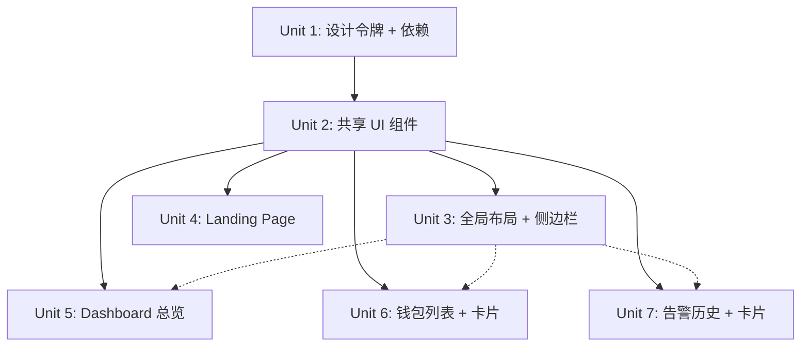

# UI 设计系统重构 — 暗黑 Glassmorphism Crypto Terminal

## Overview

将 Smart Money Radar 前端从当前的平面暗色风格升级为统一的 Glassmorphism Crypto Terminal 设计系统。涉及：设计令牌体系、全局字体/颜色/组件规范、6 个页面/组件的视觉重构、图表库集成、图标库替换。目标：Landing Page 与 Dashboard 风格统一，提升专业感和信任度。

## Problem Frame

当前前端存在以下设计问题：
1. **Landing Page 风格断裂**：白色背景 CSS 变量与 Dashboard 暗色不一致
2. **视觉平淡**：所有卡片样式雷同（`#111111` bg + `border-zinc-800`），无层次感
3. **emoji 代替图标**：`⚡ 🧠 🛡️ 📡` 不专业
4. **数据可视化缺失**：评分、胜率、PNL 全是纯文字，无 sparkline / 进度环
5. **空状态简陋**：emoji + 一行文字
6. **侧边栏缺乏品牌感**：无图标、无折叠、无系统状态

## Requirements Trace

- R1. 全局背景色从 `#0A0A0A` 改为深蓝灰 `#0a0e1a`，卡片底色 `#111827`
- R2. Glassmorphism 卡片效果：`backdrop-blur` + 半透明 + 边框微光
- R3. 双字体系统：Space Grotesk（标题）+ JetBrains Mono（数据）
- R4. Lucide React 图标替换所有 emoji
- R5. Recharts 集成：sparkline、进度环、迷你饼图
- R6. Landing Page 完整重构（Hero + 信任指标 + Bento 特性 + 安全区 + CTA）
- R7. Dashboard 统计卡片升级（微型图表 + 脉冲动画）+ Bento 快速导航
- R8. 钱包列表：评分环形进度条 + 排序筛选 + 网格/列表切换
- R9. 告警历史：时间线布局 + 严重程度标识 + 可展开 AI 详情 + 筛选
- R10. 侧边栏：Lucide 图标 + Logo 光晕 + 系统状态 + 折叠支持
- R11. 所有交互元素 hover 过渡 150-300ms
- R12. 文字对比度 >= 4.5:1
- R13. 响应式支持 375px 最小宽度
- R14. `prefers-reduced-motion` 尊重

## Scope Boundaries

**在范围内**：
- 设计令牌系统（CSS 变量 / Tailwind theme）
- 所有现有页面和组件的视觉重构
- 新增依赖安装（lucide-react, recharts, @fontsource/space-grotesk 或 Google Fonts）
- 共享 UI 组件提取（GlassCard, ScoreRing, Sparkline 等）

**不在范围内**：
- 功能逻辑变更（API 调用、认证流程、数据模型）
- 新页面添加
- 后端变更
- 单元测试（纯视觉重构，无业务逻辑变更）
- Framer Motion（当前 package.json 无此依赖，CSS transitions 足够）

## Context & Research

### Relevant Code and Patterns

- `apps/web/src/app/globals.css`: Tailwind v4 `@import "tailwindcss"` + `@theme inline` 语法
- `apps/web/src/app/layout.tsx`: JetBrains Mono 已加载为 `--font-mono`，Clerk dark theme 已配置
- 颜色硬编码分布在 15+ 个文件中，核心色值：`#0A0A0A`(bg), `#111111`(card), `#00F0FF`(cyan), `#00FF88`(green), `#FF4444`(red)
- 所有页面都是 Next.js App Router Server Components，仅 `sidebar-nav.tsx`、`pricing-card.tsx`、`load-more-alerts.tsx` 是 Client Components
- Tailwind v4 使用 `@theme inline` 定义 CSS 变量，不需要 `tailwind.config.ts`

### Institutional Learnings

- 用户指定新设计规范：CryptoVault 风格暗黑 Glassmorphism，深蓝灰底色（非纯黑），Space Grotesk 标题字体
- 明确的反模式清单：禁止纯黑 `#000000`、Inter 字体、紫色渐变、emoji 图标、灰字深底低对比度、卡片嵌套卡片

## Key Technical Decisions

- **CSS 变量 + Tailwind @theme 作为设计令牌载体**：在 `globals.css` 中用 CSS 自定义属性定义所有色值，通过 `@theme inline` 注册到 Tailwind。理由：Tailwind v4 原生支持，无需额外配置文件，所有组件通过语义类名引用。

- **Google Fonts 加载 Space Grotesk**：通过 `next/font/google` 加载，与 JetBrains Mono 共存。理由：Next.js 内置字体优化，自动 subset + preload，零外部请求。

- **Recharts 而非 TradingView Lightweight Charts**：用户明确要求 Recharts。适合 sparkline、进度环等小型可视化。TradingView 适合 Phase 3 的完整交易图表。

- **CSS transitions 而非 Framer Motion**：当前需求（hover 过渡、脉冲动画、简单入场效果）CSS 完全可以实现，避免新增 ~30KB 依赖。

- **共享组件提取到 `apps/web/src/components/ui/`**：GlassCard、ScoreRing、Sparkline 等复用组件放在 `ui/` 子目录。理由：与业务组件（alert-card, wallet-card）分层，便于维护。

- **不修改 `backend-client.ts` 和 `format.ts`**：数据获取和格式化逻辑不变，仅改变渲染层。

## Open Questions

### Resolved During Planning

- **Space Grotesk vs Sora**：选 Space Grotesk — 设计哲学文档已指定，几何感更强，适合 crypto terminal 调性
- **Framer Motion 是否引入**：不引入 — CSS transitions 覆盖所有需求（hover, pulse, glow），减少 bundle size
- **设计令牌存放位置**：`globals.css` 中的 `@theme inline` — Tailwind v4 标准方式

### Deferred to Implementation

- **Recharts 具体 sparkline 配置**：需要在实际渲染中调试间距和颜色
- **Glassmorphism blur 值微调**：`blur(12px)` 作为起点，实际效果取决于背景内容
- **响应式断点下的侧边栏行为**：折叠为图标模式的具体交互

## High-Level Technical Design

> *此设计图展示整体方案结构，为方向性指导而非实现规范。*

```
设计令牌层 (globals.css @theme inline)
├── 色彩: --smr-bg-primary, --smr-bg-card, --smr-accent-cyan, ...
├── 字体: --font-heading (Space Grotesk), --font-mono (JetBrains Mono)
├── 间距/圆角: --smr-radius-card, --smr-glass-blur, ...
└── 动画: @keyframes pulse-glow, radar-scan, ...

共享 UI 组件层 (components/ui/)
├── GlassCard — 毛玻璃卡片容器
├── ScoreRing — 环形进度条 (SVG)
├── MiniSparkline — 迷你折线图 (Recharts)
├── MiniPieChart — 微型饼图 (Recharts)
├── StatusPulse — 脉冲状态指示器
├── EmptyState — 统一空状态组件 (SVG 动画)
└── GridBackground — 网格线纹理背景

页面组件层 (重构现有文件)
├── page.tsx — Landing Page (全面重写)
├── dashboard/page.tsx — 统计卡片 + Bento 导航
├── dashboard/wallets/page.tsx — 筛选栏 + 网格/列表
├── dashboard/alerts/page.tsx — 时间线 + 筛选
├── components/sidebar-nav.tsx — Lucide + 折叠
├── components/wallet-card.tsx — ScoreRing + badges
└── components/alert-card.tsx — 时间线样式 + 可展开
```

## Implementation Units



- [ ] **Unit 1: 设计令牌基础 + 依赖安装**

**Goal:** 建立统一的设计令牌系统，安装所有新增依赖，配置字体

**Requirements:** R1, R2, R3, R4, R11, R12, R14

**Dependencies:** 无

**Files:**
- Modify: `apps/web/package.json` — 添加 lucide-react, recharts
- Modify: `apps/web/src/app/globals.css` — 设计令牌 CSS 变量 + @theme inline + 动画 keyframes
- Modify: `apps/web/src/app/layout.tsx` — 加载 Space Grotesk 字体 + 更新 body 背景色

**Approach:**
- 在 `globals.css` 中定义完整的 CSS 自定义属性体系：
  - 背景色: `--smr-bg-primary: #0a0e1a`, `--smr-bg-card: #111827`, `--smr-bg-elevated: #1a2332`
  - 强调色: `--smr-accent-cyan: #00f0ff`, `--smr-accent-green: #06d6a0`, `--smr-accent-red: #ff4444`, `--smr-accent-gold: #f5a623`
  - 文字色: `--smr-text-primary: #e2e8f0`, `--smr-text-secondary: #94a3b8`, `--smr-text-muted: #64748b`
  - 玻璃效果: `--smr-glass-bg`, `--smr-glass-border`, `--smr-glass-blur`
- 通过 `@theme inline` 将 CSS 变量注册为 Tailwind 主题值
- 定义全局 keyframes: `pulse-glow`, `radar-scan`, `fade-in`
- 添加 `@media (prefers-reduced-motion: reduce)` 规则禁用所有动画
- 通过 `next/font/google` 同时加载 Space_Grotesk 和 JetBrains_Mono

**Patterns to follow:**
- 现有 `layout.tsx` 的 `next/font/google` 加载模式
- Tailwind v4 `@theme inline` 语法（见当前 `globals.css`）

**Test expectation:** none — 纯样式/配置变更，无业务逻辑

**Verification:**
- `pnpm --filter web build` 成功
- 浏览器中背景色为深蓝灰 `#0a0e1a`
- Space Grotesk 字体正确加载（DevTools Network 面板）

---

- [ ] **Unit 2: 共享 UI 组件库**

**Goal:** 创建可复用的 UI 原语组件，为后续页面重构提供构建模块

**Requirements:** R2, R4, R5, R11, R14

**Dependencies:** Unit 1

**Files:**
- Create: `apps/web/src/components/ui/glass-card.tsx` — 毛玻璃卡片容器
- Create: `apps/web/src/components/ui/score-ring.tsx` — SVG 环形进度条（0-1 分）
- Create: `apps/web/src/components/ui/mini-sparkline.tsx` — Recharts 迷你折线图
- Create: `apps/web/src/components/ui/mini-pie-chart.tsx` — Recharts 微型饼图
- Create: `apps/web/src/components/ui/status-pulse.tsx` — 脉冲状态指示点
- Create: `apps/web/src/components/ui/empty-state.tsx` — 统一空状态（SVG 雷达动画）
- Create: `apps/web/src/components/ui/grid-background.tsx` — 网格线纹理背景
- Create: `apps/web/src/components/ui/badge.tsx` — 多样式 pill badge

**Approach:**
- `GlassCard`: div 容器，`backdrop-blur + bg-opacity + border` 实现毛玻璃效果，props 控制 hover glow 强度、border 色调
- `ScoreRing`: 纯 SVG，圆形 `stroke-dasharray` 动画，颜色从红(0)→黄(0.5)→绿(1) 渐变，props: `score: number`, `size: number`
- `MiniSparkline`: Recharts `<LineChart>` 极简配置，无坐标轴/网格/提示，仅一条线 + 区域填充，props: `data: number[]`, `color: string`, `width/height`
- `MiniPieChart`: Recharts `<PieChart>` 单数据环形，用于胜率展示
- `StatusPulse`: CSS `animation: pulse-glow` 的小圆点，props: `status: 'ok' | 'warning' | 'error'`
- `EmptyState`: 接受 SVG children 或默认雷达扫描动画，标题 + 副文本 + 可选 CTA
- `GridBackground`: 绝对定位的 CSS 渐变网格线背景，`opacity: 0.03` 微妙效果
- `Badge`: variant 控制颜色（cyan/green/gold/red），size 控制大小
- 所有组件尊重 `prefers-reduced-motion`

**Patterns to follow:**
- Server Component 优先，仅 Recharts 组件需要 `'use client'`
- Props 接口 TypeScript strict，无 `any`

**Test expectation:** none — 纯 UI 展示组件，无业务逻辑

**Verification:**
- `pnpm --filter web build` 成功无类型错误
- 各组件可在页面中正常渲染

---

- [ ] **Unit 3: 全局布局 + 侧边栏重构**

**Goal:** 重构侧边栏为带 Lucide 图标、折叠支持、系统状态的专业导航

**Requirements:** R4, R10, R11, R13

**Dependencies:** Unit 1, Unit 2

**Files:**
- Modify: `apps/web/src/components/sidebar-nav.tsx` — 完全重写
- Modify: `apps/web/src/app/dashboard/layout.tsx` — 适配折叠侧边栏宽度

**Approach:**
- 将 emoji 图标替换为 Lucide：`LayoutDashboard`(总览), `Zap`(告警), `Wallet`(钱包)
- Logo 区域：SMR 文字 + 微妙 cyan 光晕（`box-shadow: 0 0 20px rgba(0,240,255,0.15)`）
- 导航项激活状态：左边框 2px cyan + 背景渐变 `from-[accent]/10 to-transparent`
- 底部：`StatusPulse` 组件 + "系统正常" 文字
- 折叠/展开：`useState` 控制，折叠时仅显示图标，展开按钮用 `ChevronLeft`/`ChevronRight`
- 响应式：< 768px 默认折叠为图标模式
- Paywall 组件中的 emoji `🔒` 替换为 Lucide `Lock`

**Patterns to follow:**
- 现有 `sidebar-nav.tsx` 的 `usePathname` 激活判断逻辑
- Clerk `UserButton` 保持在底部

**Test expectation:** none — 纯 UI 重构

**Verification:**
- 侧边栏正确渲染 Lucide 图标
- 折叠/展开功能正常
- 当前页面高亮正确
- 375px 宽度下折叠正常

---

- [ ] **Unit 4: Landing Page 完整重构**

**Goal:** 将 Landing Page 从简单的居中布局重构为暗黑 Glassmorphism 风格的专业着陆页

**Requirements:** R1, R2, R3, R4, R6, R11, R12, R13, R14

**Dependencies:** Unit 1, Unit 2

**Files:**
- Modify: `apps/web/src/app/page.tsx` — 完全重写

**Approach:**
- **顶部导航栏**：fixed，Logo + 导航链接（功能/定价/登录）+ 发光 CTA "开始追踪"（`box-shadow: 0 0 20px rgba(0,240,255,0.3)`），滚动时 `backdrop-blur` 模糊
- **Hero 区**：
  - 左侧：Space Grotesk 大标题 "聪明钱，尽在掌握" + 副标题 + 双 CTA（主 cyan + 次 outline）
  - 右侧：GlassCard 内嵌 MiniSparkline 模拟价格走势（hardcoded demo 数据）
  - 背景：GridBackground + 径向渐变光晕（cyan 30% opacity）
- **信任指标栏**：4 个 GlassCard，数字用 Space Grotesk + cyan 大字，标签用 muted 小字
- **功能特性区**：3 列 Bento Grid（不等高），每个 GlassCard 带 Lucide 图标 + 标题 + 描述，`hover:scale-[1.02]` + border glow
  - AI 告警分析 → `Brain` 图标
  - 聪明钱评分 → `TrendingUp` 图标  
  - Rug 防护 → `ShieldCheck` 图标
- **安全信任区**：3 个安全特性（`Lock`, `Eye`, `KeyRound`），GlassCard 横排
- **底部 CTA**：重复核心行动号召，大按钮
- Landing Page 不使用侧边栏布局，独立全屏

**Patterns to follow:**
- 现有 `SignedIn` / `SignedOut` 条件渲染模式
- 现有 `Link` 路由跳转

**Test expectation:** none — 纯视觉页面，无业务逻辑

**Verification:**
- Landing Page 在 1440px/1024px/768px/375px 下正常显示
- 导航栏滚动毛玻璃效果正常
- 所有链接跳转正确
- 无 emoji 残留

---

- [ ] **Unit 5: Dashboard 总览重构**

**Goal:** 将 Dashboard 从平面统计卡片升级为带微型图表和 Bento Grid 导航的控制台

**Requirements:** R2, R4, R5, R7, R11

**Dependencies:** Unit 1, Unit 2, Unit 3

**Files:**
- Modify: `apps/web/src/app/dashboard/page.tsx` — 重写统计卡片 + 导航

**Approach:**
- **统计卡片 3 列**（GlassCard）：
  - 活跃钱包：数字 + MiniSparkline（demo 趋势数据）
  - 告警状态：StatusPulse + 文字（绿色=正常，红色=有告警）
  - 系统状态：SVG 心跳线 / 进度环
- **Bento Grid 快速导航**（2 列 GlassCard）：
  - 告警历史 → Lucide `Zap` + 描述 + hover 光晕
  - 钱包列表 → Lucide `Wallet` + 描述 + hover 光晕
  - 每张 GlassCard 带微妙渐变背景（不同色调区分）
- **最近告警预览**（可选，如果 alerts 数据可用）：展示最新 3 条告警的缩略信息
- Checkout 成功消息保留但升级为 GlassCard 样式

**Patterns to follow:**
- 现有 `Promise.allSettled` 并行获取 + 降级模式
- 现有 `StatCard` / `QuickLink` 内部组件模式（就地重写，不提取）

**Test expectation:** none — 纯视觉重构，数据获取逻辑不变

**Verification:**
- 统计卡片正确渲染微型图表
- 快速导航 hover 效果正常
- Checkout 成功消息正确显示

---

- [ ] **Unit 6: 钱包列表 + 钱包卡片重构**

**Goal:** 升级钱包展示为数据可视化丰富的卡片，添加排序筛选和视图切换

**Requirements:** R2, R4, R5, R8, R11, R13

**Dependencies:** Unit 1, Unit 2

**Files:**
- Modify: `apps/web/src/app/dashboard/wallets/page.tsx` — 添加筛选栏 + 视图切换
- Modify: `apps/web/src/components/wallet-card.tsx` — 重新设计为带 ScoreRing 的 GlassCard
- Modify: `apps/web/src/app/dashboard/wallets/[address]/page.tsx` — GlassCard 样式升级

**Approach:**
- **钱包列表页**（需转为 Client Component 以支持筛选/排序状态）：
  - 顶部工具栏：排序下拉（评分/PNL/胜率）+ 来源筛选（全部/人工/自动）+ 评分范围滑块
  - 视图切换按钮组：网格（`Grid3X3`）/ 列表（`List`）图标
  - 网格视图：现有 3 列布局但用重构后的卡片
  - 列表视图：表格样式紧凑行
- **钱包卡片重构**：
  - 左上角 Badge：来源标签（"Birdeye" / "人工标记"）
  - ScoreRing 展示评分（0-1，颜色渐变）
  - 胜率用 MiniPieChart
  - PNL 带颜色 + MiniSparkline（如果有历史数据，否则静态数字）
  - 空数据 "-" 改为优雅占位（"等待数据" + skeleton shimmer）
- **钱包详情页**：
  - MetricCard 升级为 GlassCard
  - 评分用 ScoreRing 大号版

**Patterns to follow:**
- 现有 `WalletCard` 的 props 接口和 `WalletRow` 类型
- 现有 `formatPercent` / `formatPnl` 工具函数

**Test expectation:** none — 纯视觉重构，数据接口不变

**Verification:**
- 评分环形进度条正确渲染分值和颜色
- 排序和筛选功能正常
- 网格/列表切换正常
- 空数据状态显示优雅占位
- 钱包详情页 GlassCard 渲染正常

---

- [ ] **Unit 7: 告警历史 + 告警卡片重构**

**Goal:** 将告警从简单列表升级为时间线布局，带严重程度标识和可展开 AI 详情

**Requirements:** R2, R4, R5, R9, R11, R13, R14

**Dependencies:** Unit 1, Unit 2

**Files:**
- Modify: `apps/web/src/app/dashboard/alerts/page.tsx` — 添加筛选工具栏 + 时间线布局
- Modify: `apps/web/src/components/alert-card.tsx` — 时间线样式 + 可展开
- Modify: `apps/web/src/components/load-more-alerts.tsx` — 样式适配

**Approach:**
- **告警页面**：
  - 顶部筛选工具栏：时间范围选择 + 严重程度筛选（全部/高/中/信息）+ 钱包筛选
  - 筛选状态管理（需转部分逻辑为 Client Component）
- **告警卡片重构**：
  - 时间线样式：左侧竖线 + 时间节点圆点
  - 严重程度左边框：红(`border-l-4 border-red-500`)=高风险（有 freezeAuthority）/ 黄=中 / 蓝=信息
  - 可展开 AI 详情：默认折叠，点击展开显示完整 `aiSummary`
  - GlassCard 容器
  - 代币信息行：symbol + Lucide `ExternalLink` 跳转 DexScreener
- **空状态升级**：
  - 使用 `EmptyState` 组件，内嵌 SVG 雷达扫描动画
  - 三层文字：标题 "暂无告警记录" + 副文本 + CTA 按钮

**Patterns to follow:**
- 现有 `AlertCard` props 接口和 `AlertRow` 类型
- 现有 `LoadMoreAlerts` 的游标分页模式
- 严重程度判断逻辑：`freezeAuthority != null` → 高风险，其余为信息级别

**Test expectation:** none — 纯视觉重构，分页和数据获取逻辑不变

**Verification:**
- 告警卡片显示时间线样式和左边框颜色
- 点击展开/折叠 AI 摘要正常
- 空状态显示 SVG 动画
- 加载更多按钮样式一致
- 筛选功能正常

## System-Wide Impact

- **Interaction graph:** 侧边栏折叠状态影响 `dashboard/layout.tsx` 的 main 区域宽度。需要通过 React context 或 CSS 变量传递折叠状态
- **Error propagation:** 无变更 — 所有 `Promise.allSettled` 降级逻辑保持不变
- **State lifecycle risks:** 筛选/排序状态为纯客户端，不影响服务端数据获取
- **API surface parity:** 无 API 变更
- **Unchanged invariants:** `backend-client.ts`、`format.ts`、所有 API routes、认证流程、订阅检查逻辑完全不变

## Risks & Dependencies

| Risk | Mitigation |
|------|------------|
| Tailwind v4 `@theme inline` 语法与自定义 CSS 变量的兼容性 | 已确认当前 `globals.css` 使用此语法，是正确的 v4 方式 |
| Recharts bundle size 影响加载性能 | 使用 `dynamic(() => import(...), { ssr: false })` 懒加载图表组件 |
| Glassmorphism `backdrop-blur` 在低端设备性能差 | `prefers-reduced-motion` 时禁用 blur，降级为半透明无模糊 |
| Space Grotesk 字体加载闪烁 (FOUT) | Next.js `next/font/google` 自动 subset + preload，FOUT 风险极低 |
| 颜色硬编码散布 15+ 文件 | Unit 1 建立令牌后，后续 Unit 统一替换为 CSS 变量引用 |

## Sources & References

- **Origin document:** 用户 2026-04-01 UI 重构需求说明（对话中提供）
- **Phase 2 plan:** [Phase 2 Web Dashboard Plan](2026-03-31-002-feat-phase2-web-dashboard-plan.md)
- Related code: `apps/web/src/` — 全部前端源码
- Recharts docs: sparkline + PieChart 配置
- Lucide React: 图标名称参考
