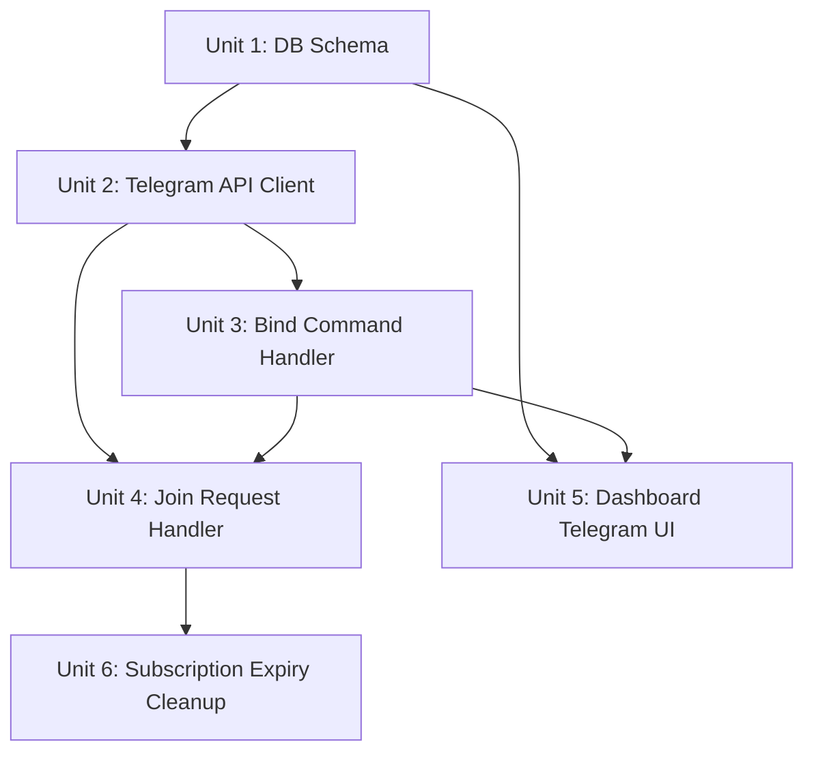

# feat: Telegram 频道准入 — Join Request 自动审批 + 用户绑定

## Overview

订阅用户当前无法加入 Telegram 私有频道接收告警。需要：
1. 订阅成功后引导用户绑定 Telegram 并加入频道
2. 通过 Bot 自动审批机制，仅允许有效订阅用户加入
3. 订阅过期后自动移除频道成员

采用 Telegram **Join Request + Webhook** 模式：频道设为需审批加入，Bot 收到 `chat_join_request` 后查库验证订阅状态，自动批准或拒绝。

## Problem Frame

- 用户付费后看不到加入 Telegram 的入口，不知道怎么接收告警
- 任何人都可以通过分享的邀请链接加入频道，无法限制非付费用户
- 用户身份（Clerk）与 Telegram 身份之间没有关联

## Requirements Trace

- R1. 订阅成功后，Dashboard 展示"绑定 Telegram"引导流程
- R2. 用户通过 Bot `/bind` 命令 + 一次性验证码完成身份绑定
- R3. 频道使用 `creates_join_request: true` 的邀请链接，用户申请后 Bot 自动审批
- R4. 未订阅用户申请加入时，Bot 通过私聊发送友好提示（告知需要先订阅）
- R5. 订阅过期/取消后，Bot 自动将用户从频道移除
- R6. Dashboard 展示 Telegram 绑定状态和频道加入状态

## Scope Boundaries

- 不实现 Telegram Bot 的其他命令（如 /start, /help 等高级交互）
- 不实现 Telegram Login Widget（浏览器内 OAuth 绑定），使用更简单的验证码绑定
- 不改变现有告警推送逻辑（仍然推送到固定 channelId）
- 不实现多频道/多群组管理
- Clerk publicMetadata 同步是 pre-existing 问题，本次仅做最小修复（在绑定流程中顺带修）

## Context & Research

### Relevant Code and Patterns

- `apps/backend/src/telegram/bot.ts` — 现有 Telegram API 调用封装（sendAlert），可复用 HTTP 调用模式
- `apps/backend/src/helio/webhook.ts` — Fastify 插件隔离 + 签名验证模式，直接复用于 Telegram webhook
- `apps/backend/src/stripe/webhook.ts` — 支付 webhook 的事件分发模式（switch on event type）
- `apps/backend/src/events.ts` — EventEmitter 事件总线，可用于绑定/订阅状态变更广播
- `packages/db/src/schema/` — Drizzle ORM schema 定义模式（users.ts, subscriptions.ts）

### Institutional Learnings

- Fire-and-forget webhook 模式：立即返回 200，后台异步处理（`docs/solutions/best-practices/fire-and-forget-webhook-graceful-degradation-2026-03-31.md`）
- Fastify 插件隔离：webhook 路由必须用独立插件注册，避免全局 content-type parser 冲突（`docs/solutions/best-practices/payment-provider-migration-china-developer-2026-04-02.md`）

### External References

- Telegram Bot API: `chat_join_request` update type, `approveChatJoinRequest`, `declineChatJoinRequest`
- Bot 必须有 `can_invite_users` 管理员权限才能接收 join request 并审批
- `setWebhook` 的 `allowed_updates` 必须显式包含 `"chat_join_request"`
- `createChatInviteLink` 的 `creates_join_request: true` 参数可创建需审批的邀请链接
- `user_chat_id` 字段允许 Bot 向申请者直接发送私聊消息（无需用户先 /start）

## Key Technical Decisions

- **Join Request 模式而非邀请链接模式**：安全性最高，Bot 在用户加入前验证订阅，而不是加入后踢出。用户体验也好——点链接申请，等待自动审批（通常秒级）。
- **验证码绑定而非 Telegram Login Widget**：Login Widget 需要前端集成 Telegram 的 JS SDK 和 OAuth 回调，复杂度高。验证码绑定（Dashboard 生成 6 位码 → 用户发给 Bot `/bind CODE`）更简单，用户操作步骤少。
- **Telegram webhook 独立端点**：与 Helius/Helio webhook 并列，在 Fastify 中用独立插件注册 `/webhooks/telegram`。使用 Telegram `secret_token` 验证请求来源。
- **绑定表独立于 users 表**：新建 `telegram_bindings` 表而不是在 users 表加字段，因为 Telegram 绑定是可选的、可撤销的，且可能有多对一场景（同一 Clerk 用户换 Telegram 账号）。
- **定时清理而非实时踢出**：订阅过期后不立即踢出（webhook 可能延迟），改用每小时一次的定时任务扫描过期订阅并移除频道成员。

## Open Questions

### Resolved During Planning

- **Bot 是否需要额外权限？** — Bot 已是管理员，需确认有 `can_invite_users`。如果没有，需要频道创建者手动在 Telegram 中给 Bot 勾选此权限。不需要代码改动。
- **如何处理 Telegram webhook 与现有 Helius webhook 共存？** — 使用 Telegram `setWebhook` API 设置独立的 webhook URL（如 `https://backend.example.com/webhooks/telegram`）。这与 Helius 的 webhook 是完全独立的，不冲突。
- **验证码过期策略？** — 生成后 10 分钟过期，使用后立即失效。存储在内存 Map 中（与 TxDedup 类似模式），不需要数据库。

### Deferred to Implementation

- `setWebhook` 的具体调用时机——可以是服务启动时自动设置，也可以是手动脚本。实现时决定。
- 频道踢出逻辑的 cron 间隔——初始设 1 小时，观察效果后调整。
- Bot 消息的具体文案——实现时根据 i18n 需求确定。

## High-Level Technical Design

> *This illustrates the intended approach and is directional guidance for review, not implementation specification.*

```
用户订阅成功
  ↓
Dashboard 显示 "绑定 Telegram" 区块
  ├─ 生成一次性 6 位验证码（10 分钟有效）
  ├─ 显示 Bot 链接 t.me/SmartMoneyRadarBot
  └─ 提示 "向 Bot 发送 /bind XXXXXX"
  
用户打开 Telegram，发送 /bind XXXXXX 给 Bot
  ↓
Bot 收到 message update → 解析 /bind 命令
  ├─ 验证码有效 → 写入 telegram_bindings 表（clerkUserId ↔ telegramId）
  ├─ 返回 "绑定成功！点击链接申请加入频道: [invite_link]"
  └─ 验证码无效/过期 → 返回 "验证码无效，请在 Dashboard 重新获取"
  
用户点击邀请链接 → Telegram 发送 chat_join_request
  ↓
Bot 收到 chat_join_request update
  ├─ 查 telegram_bindings 找到 clerkUserId
  ├─ 查 subscriptions 表确认 status = 'active'
  ├─ 有效 → approveChatJoinRequest + 发私聊 "欢迎加入！"
  └─ 无效 → declineChatJoinRequest + 发私聊 "请先订阅 Pro 计划"

定时任务（每小时）
  ├─ 扫描所有绑定用户的订阅状态
  ├─ 过期/取消 → banChatMember + 发私聊通知
  └─ 重新订阅 → unbanChatMember（用户可重新申请加入）
```

## Implementation Units



- [ ] **Unit 1: 数据库 — telegram_bindings 表 + bind_codes 存储**

**Goal:** 建立 Clerk 用户与 Telegram 用户的关联存储

**Requirements:** R2, R6

**Dependencies:** None

**Files:**
- Create: `packages/db/src/schema/telegram-bindings.ts`
- Modify: `packages/db/src/schema/index.ts` (导出新表)
- Test: `packages/db/test/schema.test.ts` (扩展现有 schema 测试)

**Approach:**
- `telegram_bindings` 表：`id`, `clerkUserId` (FK→users), `telegramId` (bigint, unique), `telegramUsername`, `boundAt`, `unboundAt` (软删除)
- `clerkUserId` 加唯一约束（一个 Clerk 用户只能绑定一个 Telegram）
- `telegramId` 加唯一约束（一个 Telegram 账号只能绑定一个 Clerk 用户）
- 验证码存储用内存 Map（TTL 10 分钟），不需要数据库表

**Patterns to follow:**
- `packages/db/src/schema/users.ts` — Drizzle pgTable 定义模式
- `packages/db/src/schema/subscriptions.ts` — 外键引用和时间戳字段

**Test scenarios:**
- Happy path: schema 定义可正确创建表、插入和查询绑定记录
- Edge case: 重复 telegramId 插入触发唯一约束冲突
- Edge case: 重复 clerkUserId 插入触发唯一约束冲突

**Verification:**
- `telegram_bindings` 表可在 Drizzle schema 中正确编译
- 从 `packages/db/src/index.ts` 可正常导出

---

- [ ] **Unit 2: Telegram Bot API 客户端扩展 + Webhook 路由**

**Goal:** 扩展现有 bot.ts 为通用 Telegram API 客户端，新增 webhook 接收端点

**Requirements:** R3, R4

**Dependencies:** None (可与 Unit 1 并行)

**Files:**
- Modify: `apps/backend/src/telegram/bot.ts` (新增 API 方法)
- Create: `apps/backend/src/telegram/webhook.ts` (Fastify 插件)
- Modify: `apps/backend/src/index.ts` (注册 Telegram webhook 路由)
- Modify: `apps/backend/src/env.ts` (新增 TELEGRAM_WEBHOOK_SECRET 环境变量)
- Test: `apps/backend/test/telegram/webhook.test.ts`

**Approach:**
- 在 `bot.ts` 中新增方法：`approveChatJoinRequest`, `declineChatJoinRequest`, `sendMessage` (通用版), `banChatMember`, `createChatInviteLink`
- 复用现有 `callTelegram` 内部函数模式（fetch + retry）
- Webhook 路由用 Fastify 插件隔离注册 `POST /webhooks/telegram`
- 使用 `X-Telegram-Bot-Api-Secret-Token` header 验证请求来源
- 路由内部按 update 类型分发：`message` → bind handler, `chat_join_request` → join handler
- 条件注册：仅当 `TELEGRAM_WEBHOOK_SECRET` 环境变量存在时注册

**Patterns to follow:**
- `apps/backend/src/helio/webhook.ts` — Fastify 插件隔离 + 签名验证
- `apps/backend/src/telegram/bot.ts` — 现有 Telegram API 调用模式

**Test scenarios:**
- Happy path: 有效 secret_token 的请求返回 200
- Error path: 无效/缺失 secret_token 返回 401
- Happy path: `chat_join_request` 类型的 update 被正确路由到 join handler
- Happy path: `message` 类型且包含 `/bind` 的 update 被路由到 bind handler
- Edge case: 未知 update 类型静默忽略，返回 200
- Integration: webhook 路由仅在环境变量配置时注册

**Verification:**
- Telegram webhook 端点可接收 POST 请求并验证 secret_token
- 不同 update 类型被正确分发到对应 handler

---

- [ ] **Unit 3: /bind 命令处理 — 验证码生成与验证**

**Goal:** 实现用户通过 Bot /bind 命令完成 Telegram ID 与 Clerk 用户的绑定

**Requirements:** R2

**Dependencies:** Unit 1 (telegram_bindings 表), Unit 2 (webhook 路由)

**Files:**
- Create: `apps/backend/src/telegram/bind.ts` (绑定逻辑)
- Create: `apps/backend/src/telegram/bind-codes.ts` (验证码生成/验证)
- Modify: `apps/backend/src/telegram/webhook.ts` (集成 bind handler)
- Modify: `apps/backend/src/index.ts` (注册 `GET /api/v1/telegram/bind-code` 和 `GET /api/v1/telegram/status` 路由)
- Test: `apps/backend/test/telegram/bind.test.ts`
- Test: `apps/backend/test/telegram/bind-codes.test.ts`

**Approach:**
- `bind-codes.ts`：内存 Map 存储 `{ code → { clerkUserId, expiresAt } }`，6 位随机数字，10 分钟 TTL
- 提供 `generateBindCode(clerkUserId)` 和 `consumeBindCode(code)` 两个函数
- `bind.ts`：处理 `/bind XXXXXX` 消息，验证码有效则写入 `telegram_bindings`，通过 `user_chat_id` 回复结果
- 绑定成功后回复消息包含频道邀请链接
- 已绑定用户重复 `/bind` → 提示已绑定

**Patterns to follow:**
- `apps/backend/src/webhook/dedup.ts` — TxDedup 的 TTL Map 模式

**Test scenarios:**
- Happy path: 生成验证码 → 消费成功 → 返回 clerkUserId
- Edge case: 验证码过期（10 分钟后）→ 消费失败
- Edge case: 验证码已使用 → 二次消费失败
- Happy path: /bind 有效码 → telegram_bindings 写入成功 → Bot 回复"绑定成功"
- Error path: /bind 无效码 → Bot 回复"验证码无效"
- Edge case: 同一 Telegram 用户重复 /bind → 提示已绑定
- Edge case: /bind 缺少参数 → Bot 回复使用说明
- Error path: 不同 Clerk 用户尝试绑定同一 Telegram ID → 唯一约束冲突 → Bot 回复"此 Telegram 账号已绑定其他用户"
- Happy path: `GET /api/v1/telegram/bind-code` 需 Clerk 鉴权，返回 `{ code, expiresAt }`
- Happy path: `GET /api/v1/telegram/status` 需 Clerk 鉴权，返回 `{ status: 'not_bound' | 'bound_not_subscribed' | 'bound_and_subscribed', telegramUsername? }`

**Verification:**
- 验证码生成和消费的完整生命周期正常工作
- telegram_bindings 表正确记录绑定关系
- Bot 在各种场景下返回正确的回复消息

---

- [ ] **Unit 4: chat_join_request 处理 — 订阅验证与自动审批**

**Goal:** Bot 收到频道加入请求时，自动验证订阅状态并批准/拒绝

**Requirements:** R3, R4

**Dependencies:** Unit 1, Unit 2, Unit 3

**Files:**
- Create: `apps/backend/src/telegram/join-request.ts`
- Modify: `apps/backend/src/telegram/webhook.ts` (集成 join handler)
- Test: `apps/backend/test/telegram/join-request.test.ts`

**Approach:**
- 收到 `chat_join_request` → 用 `from.id` (telegramId) 查 `telegram_bindings` → 找到 `clerkUserId` → 查 `subscriptions` 表
- 订阅 active → `approveChatJoinRequest` + 发私聊 "欢迎加入 Smart Money Radar 告警频道！"
- 未绑定 → `declineChatJoinRequest` + 发私聊 "请先在 Dashboard 绑定 Telegram 账号"（附 Dashboard 链接）
- 绑定了但未订阅 → `declineChatJoinRequest` + 发私聊 "请先订阅 Pro 计划"（附 pricing 页面链接）
- 所有 Telegram API 调用 fire-and-forget，webhook 立即返回 200

**Patterns to follow:**
- `apps/backend/src/pipeline.ts` — Promise.allSettled 并行调用模式
- Fire-and-forget webhook 模式（`docs/solutions/best-practices/fire-and-forget-webhook-graceful-degradation-2026-03-31.md`）

**Test scenarios:**
- Happy path: 已绑定 + 订阅 active → approveChatJoinRequest 被调用
- Happy path: 批准后发送欢迎私聊消息
- Error path: 未绑定用户 → declineChatJoinRequest + 友好提示
- Error path: 已绑定但订阅过期 → declineChatJoinRequest + 订阅提示
- Edge case: Telegram API 调用失败（approveChatJoinRequest 返回 400）→ 优雅降级，记录日志
- Integration: webhook 收到 chat_join_request → 触发完整的验证-审批链路

**Verification:**
- 有效订阅用户的加入请求被自动批准
- 无效用户收到友好的拒绝提示消息
- Telegram API 错误不会导致 webhook 返回非 200

---

- [ ] **Unit 5: Dashboard Telegram 绑定 UI**

**Goal:** 订阅用户在 Dashboard 中看到 Telegram 绑定引导和状态

**Requirements:** R1, R6

**Dependencies:** Unit 3 (bind API)

**Files:**
- Create: `apps/web/src/components/telegram-bind.tsx` (绑定组件)
- Modify: `apps/web/src/app/dashboard/page.tsx` (嵌入绑定组件)
- Create: `apps/web/src/app/api/telegram/bind-code/route.ts` (Next.js API route 生成验证码)
- Modify: `apps/web/messages/zh.json` (i18n)
- Modify: `apps/web/messages/en.json` (i18n)

**Approach:**
- 新组件 `TelegramBind`：三种状态显示
  - 未绑定：显示验证码 + Bot 链接 + 操作说明
  - 已绑定未加入频道：显示频道邀请链接
  - 已绑定已加入：显示绿色 ✓ 状态
- Next.js API route `/api/telegram/bind-code` 转发到后端生成验证码
- 后端需新增 `GET /api/v1/telegram/bind-code` 端点（返回验证码）和 `GET /api/v1/telegram/status` 端点（返回绑定状态）
- 验证码显示为大号等宽字体，可一键复制
- 绑定状态放在 Dashboard 首页的 checkout success 提示下方

**Patterns to follow:**
- `apps/web/src/components/helio-checkout.tsx` — 第三方服务集成组件模式
- `apps/web/src/app/api/alerts/route.ts` — Next.js API proxy route 模式

**Test scenarios:**
- Happy path: 已订阅未绑定用户看到验证码 + 操作引导
- Happy path: 点击"生成验证码"→ 显示 6 位码 + 复制按钮
- Happy path: 已绑定用户看到绑定状态 + 频道链接
- Edge case: 未订阅用户不显示绑定区块（被 SubscriptionGuard 拦截）
- Error path: 验证码生成 API 失败 → 显示重试按钮

**Verification:**
- 组件在三种状态下正确渲染
- 验证码可通过 API 正确生成和展示
- i18n 键在中英文下都有对应翻译

---

- [ ] **Unit 6: 订阅过期自动清理**

**Goal:** 定时检查订阅状态，将过期用户从 Telegram 频道移除

**Requirements:** R5

**Dependencies:** Unit 1, Unit 2

**Files:**
- Create: `apps/backend/src/telegram/cleanup.ts`
- Modify: `apps/backend/src/index.ts` (注册定时任务)
- Test: `apps/backend/test/telegram/cleanup.test.ts`

**Approach:**
- `cleanupExpiredMembers()` 函数：查询所有 telegram_bindings JOIN subscriptions，找出订阅状态非 active 的绑定用户
- 对每个过期用户调用 `banChatMember`（会自动从频道移除）
- 然后立即 `unbanChatMember`（允许未来重新订阅后再次申请加入）
- 通过 `user_chat_id` 发私聊通知："您的订阅已过期，已从告警频道移出。重新订阅后可再次加入。"
- 使用 `setInterval` 注册（初始每小时一次），在服务启动时设置
- 加日志记录每次清理的结果

**Patterns to follow:**
- `apps/backend/src/discovery/orchestrator.ts` — 定时任务注册模式（如有）

**Test scenarios:**
- Happy path: 过期用户被 ban → 立即 unban → 收到通知消息
- Edge case: 用户已自行退出频道 → banChatMember 返回错误 → 静默跳过
- Edge case: 没有过期用户 → 函数快速返回，不调用任何 API
- Error path: Telegram API 限流 → 记录日志，跳过当前用户，下次重试
- Happy path: 用户重新订阅后，可通过邀请链接再次申请加入

**Verification:**
- 过期用户被成功从频道移除
- 移除后用户未被永久封禁（可重新加入）
- API 错误不导致整个清理任务中断

## System-Wide Impact

- **Interaction graph:** Helio/Paddle webhook → subscription 写入 → 触发清理任务关注。Telegram webhook → bind/join handler → 查询 subscriptions + telegram_bindings 表。Dashboard → bind-code API → 后端生成码。
- **Error propagation:** Telegram API 调用失败不应影响 webhook 响应（fire-and-forget）。数据库查询失败应降级为拒绝加入请求（安全侧）。
- **State lifecycle risks:** 验证码在内存中，服务重启会丢失（可接受，用户重新生成即可）。telegram_bindings 用软删除（unboundAt），避免历史数据丢失。
- **API surface parity:** 后端需新增 2 个 API 端点（bind-code, telegram-status），需添加到 Fastify 路由和前端 proxy。
- **Unchanged invariants:** 现有告警推送逻辑（pipeline → sendAlert → channelId）完全不变。现有 Helius/Helio/Paddle webhook 不受影响。

## Risks & Dependencies

| Risk | Mitigation |
|------|------------|
| Bot 缺少 `can_invite_users` 权限 | 部署前手动在 Telegram 频道设置中确认 Bot 权限 |
| Bot 缺少 `can_restrict_members` 权限 | 部署前确认 Bot 有此权限（Unit 6 的 banChatMember/unbanChatMember 需要） |
| Telegram API 限流（批量踢出时） | cleanup 任务中加延迟（每个请求间隔 100ms），限流时 skip + retry |
| 验证码被暴力猜测 | 6 位数字 + 10 分钟过期 + 单次使用，猜中概率极低；如需加强可改用 UUID |
| 服务重启丢失内存中的验证码 | 可接受风险，用户重新生成即可（10 分钟窗口内重启概率低） |
| `setWebhook` 与现有 Helius webhook 冲突 | 不冲突——Telegram 的 setWebhook 是设置 Telegram Bot 的回调 URL，与 Helius 完全独立 |

## Documentation / Operational Notes

- 部署前需手动运行一次 `setWebhook` 设置 Telegram Bot 的 webhook URL（可用 curl 或启动脚本）
- 需在 Railway 环境变量中添加 `TELEGRAM_WEBHOOK_SECRET`
- 需确认 Bot 在频道中有 `can_invite_users` 和 `can_restrict_members` 权限
- 需用 `createChatInviteLink` 创建一个 `creates_join_request: true` 的邀请链接，保存为环境变量 `TELEGRAM_INVITE_LINK`

## Sources & References

- Related code: `apps/backend/src/telegram/bot.ts`, `apps/backend/src/helio/webhook.ts`
- Learnings: `docs/solutions/best-practices/fire-and-forget-webhook-graceful-degradation-2026-03-31.md`
- Learnings: `docs/solutions/best-practices/payment-provider-migration-china-developer-2026-04-02.md`
- External: Telegram Bot API — `chat_join_request`, `approveChatJoinRequest`, `createChatInviteLink`
