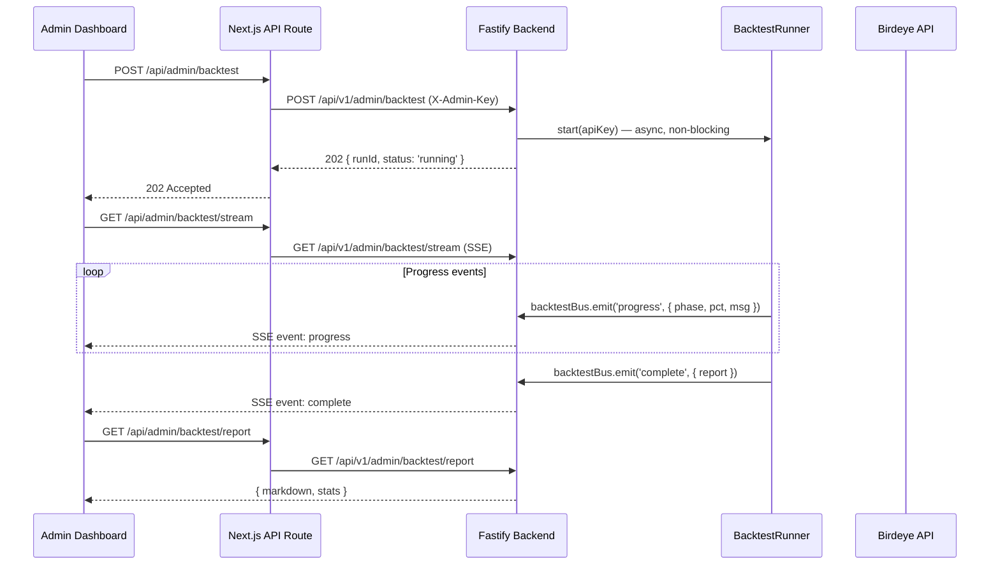

# feat: Admin Backtest Management Dashboard

## Overview

回测目前只能通过 CLI 运行，且本地环境的 Birdeye API key 权限不足导致采集全部失败。需要将回测逻辑封装为后端 API 服务，通过管理员专属 Dashboard 页面触发和管理，利用生产环境的 API key 运行回测。

## Problem Frame

用户在本地执行 `pnpm backtest --seed-from-birdeye` 时，Birdeye `wallet/tx_list` 对所有钱包返回失败（可能是免费层限制）。生产环境的 Fastify 服务拥有正确的 API key，但没有 HTTP 接口触发回测。同时，回测是运营/验证工具，不应暴露给普通订阅用户。

## Requirements Trace

- R1. 管理员可通过 Dashboard 页面一键触发回测
- R2. 回测在后端异步执行，不阻塞 HTTP 请求
- R3. 管理员可实时查看回测进度（SSE 推送）
- R4. 回测完成后可查看 Markdown 报告
- R5. 仅 admin 角色可访问，普通用户不可见
- R6. 现有 CLI 回测功能不受影响（向后兼容）

## Scope Boundaries

- 不做回测历史持久化到数据库（MVP 用内存存储运行状态，重启后丢失；报告输出为 JSON/Markdown 文件保留在 data/backtest/）
- 不做定时自动回测（cron）
- 不做回测参数自定义（固定使用 --seed-from-birdeye 模式）
- 不新建数据库表
- 不修改现有用户端 Dashboard 页面

## Context & Research

### Relevant Code and Patterns

- `apps/backend/src/scripts/backtest/cli.ts` — 现有回测管线逻辑，需提取为可调用服务
- `apps/backend/src/api/alerts-stream.ts` — SSE 推送模式参考
- `apps/backend/src/events.ts` — EventEmitter 事件总线模式
- `apps/backend/src/api/auth.ts` — X-API-Key 鉴权模式
- `apps/web/src/app/dashboard/layout.tsx` — Clerk `currentUser()` + publicMetadata 检查模式
- `apps/web/src/lib/backend-client.ts` — 后端 API 客户端（server-only）
- `apps/web/src/app/api/alerts/stream/route.ts` — SSE 代理路由模式
- `apps/web/src/components/realtime-alerts.tsx` — EventSource 客户端消费模式

### Institutional Learnings

- SSE 实时告警模式已验证可靠（`docs/solutions/best-practices/sse-realtime-alerts-timeline-pattern-2026-04-02.md`）
- Clerk publicMetadata 用于存储用户状态（subscriptionStatus），扩展为 role 字段自然

## Key Technical Decisions

- **Admin 鉴权: Clerk publicMetadata.role** — 不新建数据库表，复用 Clerk 现有模式。管理员通过 Clerk Dashboard 手动设置 `publicMetadata.role = 'admin'`。前端在 layout.tsx 检查，后端用独立 admin API key 保护 admin 路由
- **回测状态: 内存 Map** — 回测是低频操作（一天最多跑几次），不需要数据库持久化。服务重启后状态丢失可接受（MVP）
- **进度推送: SSE** — 复用 alerts-stream 的 EventEmitter + SSE 模式，不引入新依赖
- **提取回测 runner** — 从 cli.ts 的 `main()` 提取核心逻辑为 `BacktestRunner` 类，支持进度回调。CLI 调用 runner，API 也调用同一个 runner

## Open Questions

### Resolved During Planning

- **Q: Admin 路由如何鉴权？** — 前端 Clerk publicMetadata 检查 + 后端 X-Admin-Key header（独立于普通 API key，环境变量 `ADMIN_API_KEY`）
- **Q: 回测并发怎么处理？** — 同一时间只允许一个回测运行，第二次触发返回 409 Conflict

### Deferred to Implementation

- SSE 连接断开后重连的具体行为
- 报告 Markdown 的前端渲染样式细节

## High-Level Technical Design

> *This illustrates the intended approach and is directional guidance for review, not implementation specification.*

## Implementation Units

- [ ] **Unit 1: 提取 BacktestRunner 服务模块**

**Goal:** 从 CLI 的 main() 中提取回测核心逻辑为可复用的 BacktestRunner，支持进度回调

**Requirements:** R2, R6

**Dependencies:** None

**Files:**
- Create: `apps/backend/src/scripts/backtest/runner.ts`
- Modify: `apps/backend/src/scripts/backtest/cli.ts` (调用 runner 替代内联逻辑)
- Test: `apps/backend/test/scripts/backtest/runner.test.ts`

**Approach:**
- 创建 `BacktestRunner` 类，封装 seed → collect → track → analyze → report 全流程
- 构造参数: `{ apiKey, outputDir, rateLimiter, onProgress: (event: BacktestProgress) => void }`
- `BacktestProgress` 类型: `{ phase: 'seed' | 'collect-smart' | 'collect-baseline' | 'track-smart' | 'track-baseline' | 'analyze', percent: number, message: string }`
- `run()` 方法返回 `Promise<BacktestReport>`，报告直接从 analyze 模块获取
- CLI 的 main() 改为创建 runner 实例并调用 run()，保持现有行为完全一致

**Patterns to follow:**
- `cli.ts` 现有的双模式（seed mode / config file mode）逻辑
- `events.ts` 的 EventEmitter 模式

**Test scenarios:**
- Happy path: runner.run() 调用 collect + track + analyze 完整管线，返回 BacktestReport
- Happy path: onProgress 回调按 phase 顺序触发（seed → collect-smart → collect-baseline → track-smart → track-baseline → analyze）
- Error path: Birdeye API 失败 → runner 抛出错误，不静默吞掉
- Integration: CLI 使用 runner 后行为与重构前一致（现有 CLI 测试通过）

**Verification:**
- 现有 291 个测试全部通过
- CLI `pnpm backtest --help` 输出不变

- [ ] **Unit 2: 后端回测 API 端点**

**Goal:** 添加 admin-only API 端点：触发回测、查询状态、获取报告、SSE 进度流

**Requirements:** R1, R2, R3, R4, R5

**Dependencies:** Unit 1

**Files:**
- Create: `apps/backend/src/api/admin-backtest.ts`
- Modify: `apps/backend/src/index.ts` (注册新路由)
- Create: `apps/backend/src/api/admin-auth.ts` (admin 鉴权 hook)
- Test: `apps/backend/test/api/admin-backtest.test.ts`

**Approach:**
- `POST /api/v1/admin/backtest` — 触发回测，返回 202 `{ runId, status: 'running' }`。若已有运行中回测返回 409
- `GET /api/v1/admin/backtest/status` — 返回当前/最近回测状态 `{ runId, status, progress, startedAt }`
- `GET /api/v1/admin/backtest/report` — 返回最近回测报告 `{ markdown, stats, generatedAt }`
- `GET /api/v1/admin/backtest/stream` — SSE 进度推送
- Admin 鉴权: `X-Admin-Key` header 匹配 `ADMIN_API_KEY` 环境变量
- 回测状态用 module-level 变量（单例 Map）存储，服务重启后清空

**Patterns to follow:**
- `api/alerts-stream.ts` 的 SSE endpoint 模式
- `api/auth.ts` 的 onRequest hook 鉴权模式
- `api/alerts.ts` 的 route registration 模式

**Test scenarios:**
- Happy path: POST 触发回测 → 返回 202 + runId
- Happy path: GET /status 返回当前运行进度
- Happy path: GET /report 返回 Markdown 报告
- Edge case: 并发触发 → 第二次返回 409 Conflict
- Edge case: 无历史报告时 GET /report → 404
- Error path: 缺少 X-Admin-Key → 403
- Error path: 错误的 X-Admin-Key → 403
- Integration: POST 触发 → SSE stream 收到 progress 事件 → 最终收到 complete 事件

**Verification:**
- API 端点在 `/api/v1/admin/*` 路径下注册
- 非 admin 请求被 403 拒绝
- SSE 流正常推送进度

- [ ] **Unit 3: 前端 Admin 路由 + 鉴权**

**Goal:** 创建 `/admin/backtest` 路由，Clerk admin role 检查，admin 布局

**Requirements:** R5

**Dependencies:** None（可与 Unit 1-2 并行）

**Files:**
- Create: `apps/web/src/app/admin/layout.tsx`
- Create: `apps/web/src/app/admin/backtest/page.tsx` (骨架页面)
- Modify: `apps/web/src/lib/backend-client.ts` (添加 admin API 调用方法)

**Approach:**
- `admin/layout.tsx`: Server Component，用 `currentUser()` 检查 `publicMetadata.role === 'admin'`，非 admin 重定向到 /dashboard
- `backtest/page.tsx`: 初始骨架页面，后续 Unit 4 填充内容
- `backend-client.ts`: 添加 `adminFetch()` 方法，使用 `ADMIN_API_KEY` header

**Patterns to follow:**
- `dashboard/layout.tsx` 的 Clerk auth 检查模式
- `backend-client.ts` 的 `apiFetch()` 封装模式

**Test expectation:** none — 纯布局/路由骨架，无业务逻辑

**Verification:**
- 非 admin 用户访问 /admin/backtest 被重定向
- admin 用户看到骨架页面

- [ ] **Unit 4: 前端回测管理页面**

**Goal:** 完整的回测管理界面：触发按钮、实时进度、报告查看

**Requirements:** R1, R3, R4

**Dependencies:** Unit 2, Unit 3

**Files:**
- Modify: `apps/web/src/app/admin/backtest/page.tsx`
- Create: `apps/web/src/components/admin/backtest-panel.tsx` (Client Component)
- Create: `apps/web/src/app/api/admin/backtest/route.ts` (POST 代理)
- Create: `apps/web/src/app/api/admin/backtest/stream/route.ts` (SSE 代理)
- Create: `apps/web/src/app/api/admin/backtest/report/route.ts` (GET 代理)

**Approach:**
- `backtest-panel.tsx` (Client Component):
  - "开始回测" 按钮 → POST /api/admin/backtest
  - SSE 监听进度 → 进度条 + 阶段文字
  - 完成后自动加载报告 → Markdown 渲染
  - 运行中禁用按钮，显示进度
- API 代理路由复用 alerts 的代理模式，添加 Clerk auth 检查
- Markdown 报告用 `react-markdown` 或简单 `<pre>` 渲染（MVP）

**Patterns to follow:**
- `components/realtime-alerts.tsx` 的 EventSource 消费模式
- `app/api/alerts/route.ts` 的 API 代理模式
- `app/api/alerts/stream/route.ts` 的 SSE 代理模式

**Test scenarios:**
- Happy path: 点击按钮 → 进度条从 0% 到 100% → 显示报告
- Edge case: 回测已在运行 → 按钮禁用 + 提示
- Error path: API 调用失败 → 显示错误信息
- Integration: 前端 SSE → Next.js 代理 → Fastify SSE → BacktestRunner 进度回调完整链路

**Verification:**
- Admin 可以触发回测并看到实时进度
- 报告以 Markdown 格式显示

## System-Wide Impact

- **Interaction graph:** 新增 admin API 路由，不影响现有 `/api/v1/alerts`、`/api/v1/wallets` 等端点
- **Error propagation:** 回测失败 → SSE 推送 error 事件 → 前端显示错误信息，不影响主服务
- **State lifecycle risks:** 内存中的回测状态在服务重启后丢失（MVP 可接受）
- **API surface parity:** admin 端点使用独立鉴权（X-Admin-Key），不影响普通 X-API-Key 认证
- **Unchanged invariants:** CLI 回测功能不变、现有 Dashboard 页面不变、用户端无感知

## Risks & Dependencies

| Risk | Mitigation |
|------|------------|
| 回测占用大量 API 调用配额 | 同一时间只允许一个回测，30 rpm 限流已内置 |
| Admin key 泄露 | 独立于普通 API key，环境变量管理，不暴露给前端 |
| 长时间回测阻塞 Node.js 事件循环 | 回测使用 async/await + rate limiter，不阻塞事件循环 |
| Clerk publicMetadata 需要手动设置 admin | MVP 阶段可接受，后续可加管理界面 |

## Sources & References

- Related code: `apps/backend/src/api/alerts-stream.ts` (SSE 模式)
- Related code: `apps/backend/src/scripts/backtest/cli.ts` (回测管线)
- Related code: `apps/web/src/app/dashboard/layout.tsx` (Clerk auth 模式)
- Related code: `apps/web/src/lib/backend-client.ts` (API 客户端)
- Institutional learning: `docs/solutions/best-practices/sse-realtime-alerts-timeline-pattern-2026-04-02.md`
